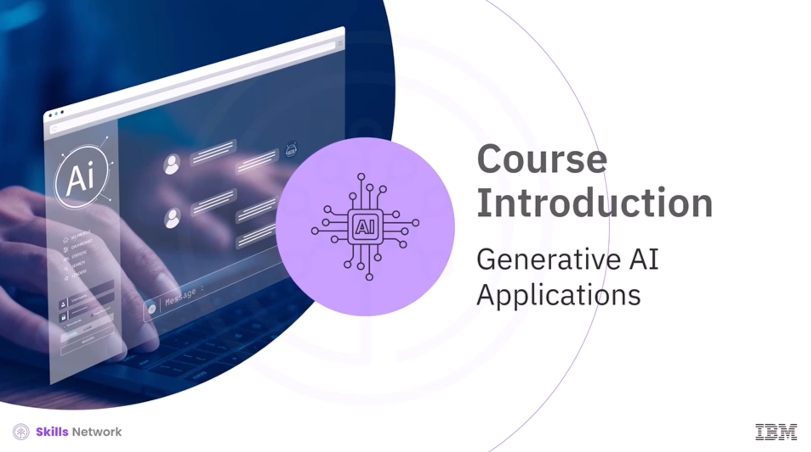
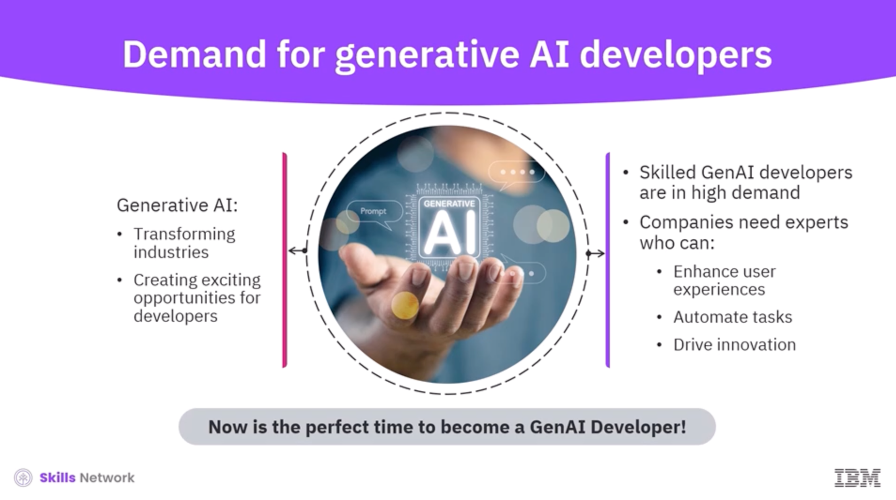
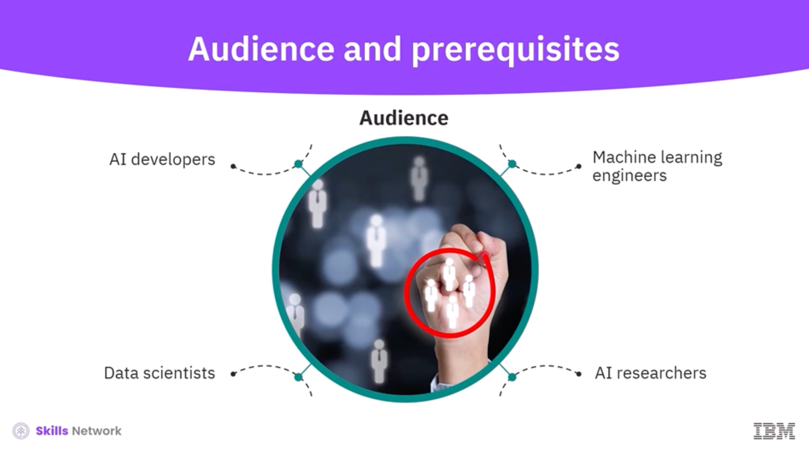
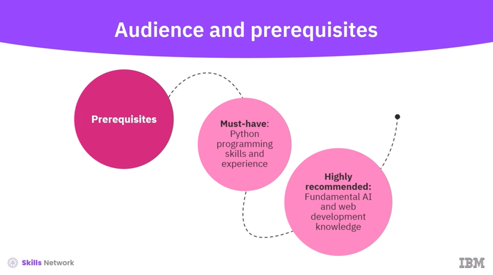
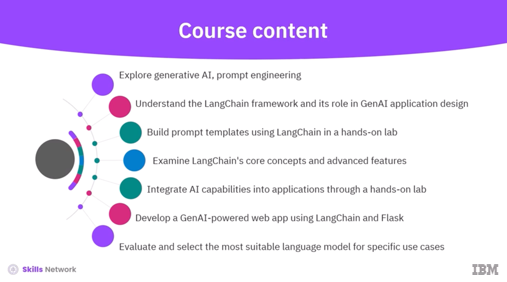
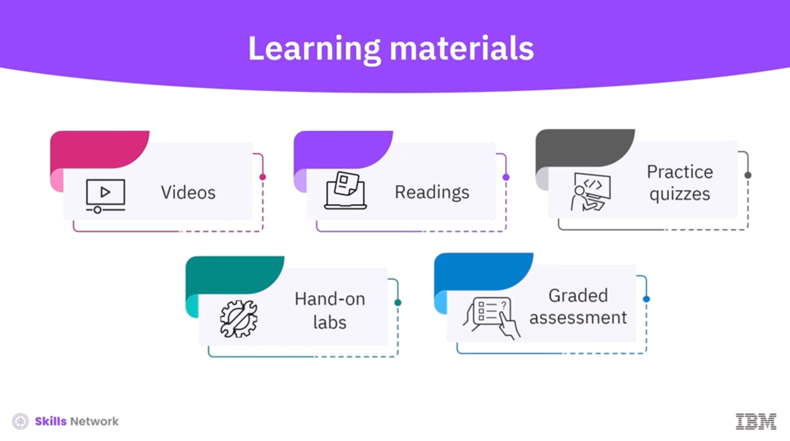

# Course Introduction

## Introducción

Introducción general al curso *Generative AI Applications*, su enfoque práctico y las oportunidades profesionales que ofrece el desarrollo de aplicaciones basadas en inteligencia artificial generativa.

El curso comienza dando la bienvenida al estudiante y contextualizando el auge de las aplicaciones de inteligencia artificial generativa dentro del ecosistema tecnológico actual.

---

La inteligencia artificial generativa está transformando múltiples industrias y creando nuevas oportunidades para desarrolladores capaces de construir aplicaciones inteligentes y dinámicas.

---

Los desarrolladores especializados en GenAI tienen una alta demanda en el mercado laboral. Las empresas buscan expertos que puedan diseñar y optimizar modelos de IA para:
- Mejorar la experiencia del usuario
- Automatizar tareas
- Impulsar la innovación

---

Esto convierte al momento actual en una etapa ideal para aprender a desarrollar aplicaciones con inteligencia artificial generativa y explorar su potencial profesional.

El curso está dirigido a:
- Desarrolladores de IA
- Ingenieros de machine learning
- Científicos de datos
- Investigadores en IA
- Perfiles técnicos relacionados

---

Es indispensable contar con experiencia en programación en Python, ya que el curso se enfoca directamente en el desarrollo de código y aplicaciones.

También se recomienda tener conocimientos básicos de:
- Inteligencia artificial
- Desarrollo web

---

A lo largo del curso:
- Se exploran los fundamentos de la IA generativa y el *prompt engineering*
- Se estudia el framework LangChain y su rol en el diseño de aplicaciones GenAI
- Se realizan laboratorios prácticos para construir *prompt templates*
- Se desarrollará una aplicación web con Flask y LangChain
- Se evaluarán distintos modelos de lenguaje para casos de uso específicos

---

Ir al siguiente material:
[2. RAG and Agentic AI Professional Certificate Overview](../2%20RAG%20and%20Agentic%20AI%20Professional%20Certificate%20Overview/README.md)
