# RAG and Agentic AI Professional Certificate Overview

## Introducción

Este certificado profesional se enfoca en la evolución de la inteligencia artificial más allá de los modelos tradicionales, presentando arquitecturas y enfoques modernos que permiten construir aplicaciones más inteligentes, contextuales y autónomas.

El programa gira en torno a tres grandes pilares:
- **RAG (Retrieval Augmented Generation)**
- **Multimodal AI**
- **Agentic AI**

Estos enfoques pueden funcionar de manera independiente, pero su verdadero potencial surge cuando se combinan para crear sistemas de IA más potentes, flexibles y adaptables.

---

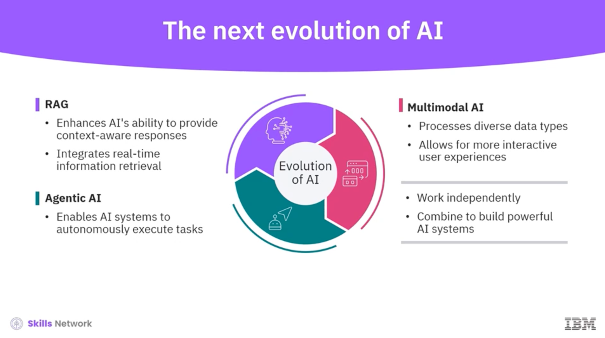

## What you'll gain

El programa está diseñado para dotarte de habilidades prácticas y aplicables en la industria.

A lo largo del certificado desarrollarás:
- Experiencia para **diseñar, construir e implementar aplicaciones de IA**
- Conocimiento para impulsar **innovación basada en IA**
- Una **ventaja competitiva** en el mercado laboral tecnológico

---

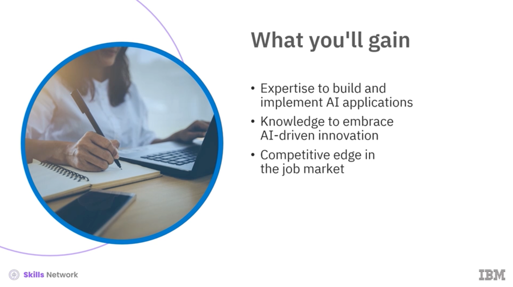

## About the program

El recorrido del programa está compuesto por una serie de cursos cortos, cada uno enfocado en un área clave del desarrollo de aplicaciones modernas con IA.

Cada curso puede completarse de forma independiente y está estructurado en módulos con evaluaciones prácticas y proyectos.

---

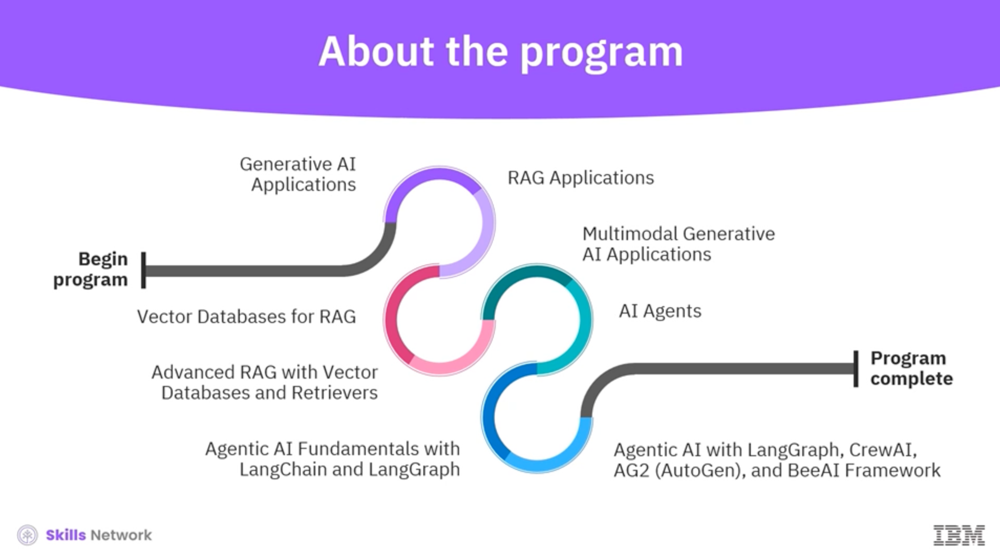

### Estructura general del programa

El programa comienza con los fundamentos y avanza progresivamente hacia arquitecturas más complejas:

1. **Generative AI Applications**
2. **RAG Applications**
3. **Vector Databases for RAG**
4. **Advanced RAG with Vector Databases and Retrievers**
5. **Multimodal Generative AI Applications**
6. **AI Agents**
7. **Agentic AI Fundamentals with LangChain and LangGraph**
8. **Agentic AI with LangGraph, CrewAI, AG2 (AutoGen), and BeeAI Framework**

Completar los cursos requeridos y sus proyectos otorga el certificado final del programa.

---
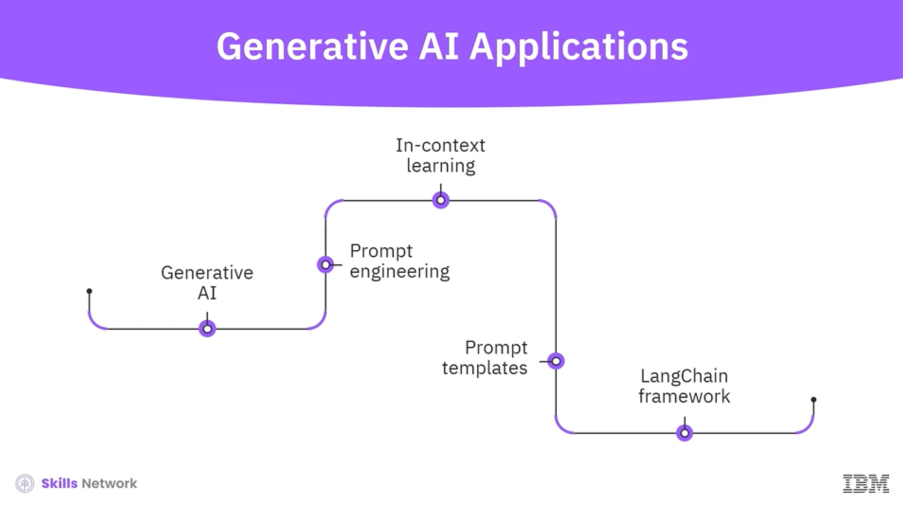

El primer curso introduce los **fundamentos de la IA generativa**, junto con un análisis profundo de:
- Prompt engineering
- In-context learning
- Prompt templates

También se presenta el **framework LangChain**, que permite construir aplicaciones de IA de manera estructurada y eficiente mediante el encadenamiento de prompts.

---

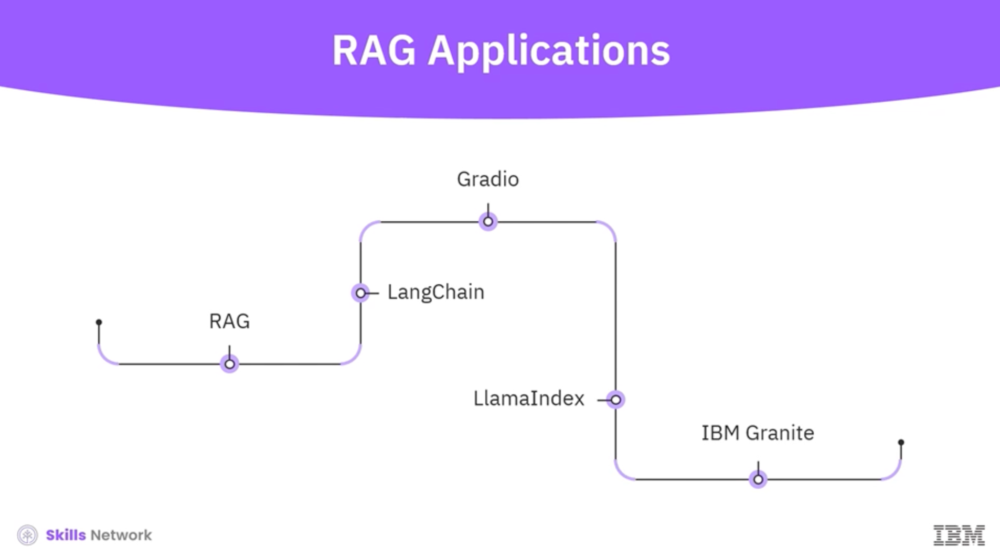

En el segundo curso se exploran los componentes clave de **Retrieval Augmented Generation (RAG)**.

Se aprende a:
- Implementar RAG usando LangChain
- Integrar recuperación de información en tiempo real
- Mejorar la precisión y contextualización de las respuestas del modelo

Además, se introduce **Gradio** para crear interfaces de interacción con modelos de IA.

---

## Vector Databases for RAG

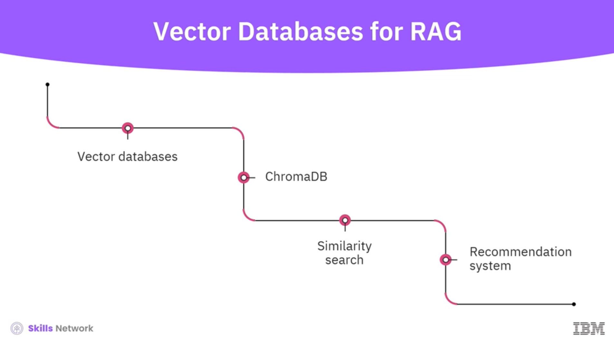

Este curso profundiza en el rol de las **bases de datos vectoriales** dentro de sistemas modernos de IA.

Se estudia:
- Arquitectura de **ChromaDB**
- Operaciones vectoriales básicas
- Buenas prácticas de implementación

---

## Advanced RAG with Vector Databases and Retrievers

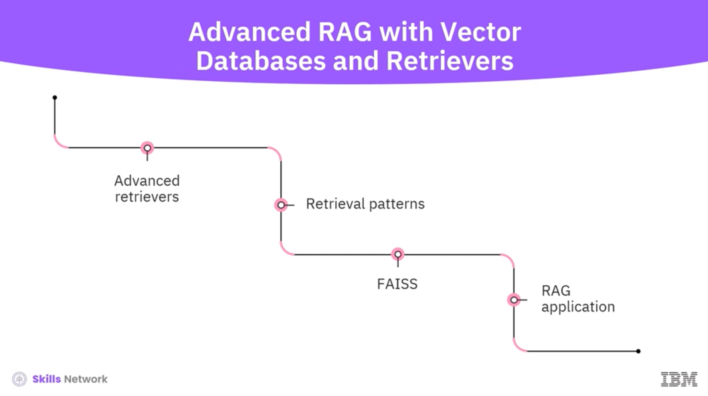

Este curso se centra en:
- **Retrievers avanzados**
- Patrones de recuperación
- Optimización de estrategias de retrieval dentro de sistemas RAG

---

## Similarity Search and Recommendation Systems

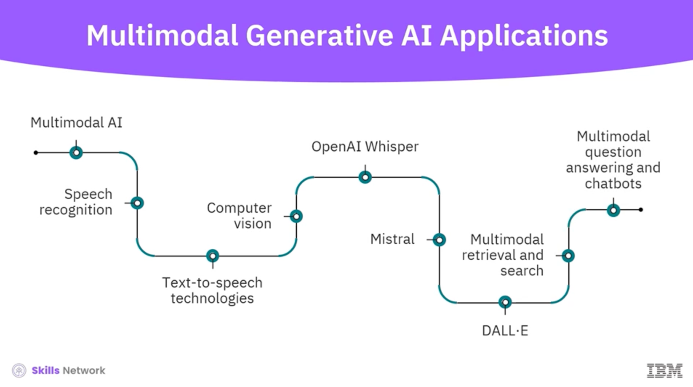

Aquí se trabaja con:
- Búsqueda por similitud
- Embeddings
- Construcción de un **sistema de recomendación** usando una base de datos vectorial

Este bloque conecta teoría con implementación práctica mediante laboratorios.

---

## Multimodal Tools and Models

Se utilizan herramientas y modelos como:
- **OpenAI Whisper**
- **Mistral**
- **DALL·E**

También se abordan:
- Image captioning
- Multimodal retrieval
- Multimodal question answering y chatbots

---

## FAISS and RAG Applications

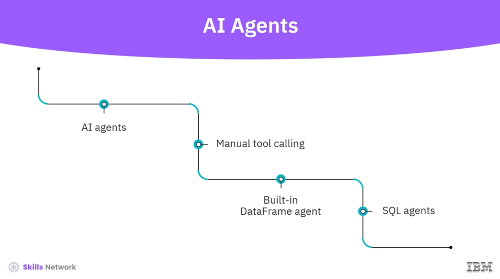

Se introduce **FAISS**, una base de datos vectorial de alto rendimiento para búsqueda por similitud.

Con FAISS se construye una aplicación RAG combinando:
- FAISS
- LangChain
- Gradio

---

## AI Agents and Agentic Architectures

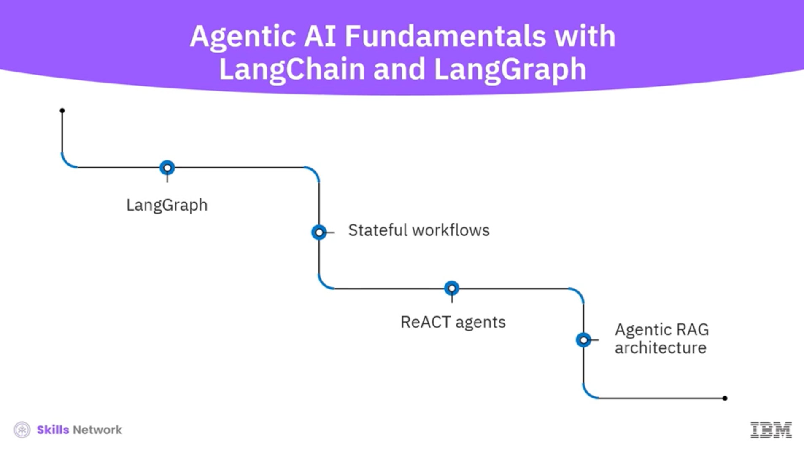

Los últimos cursos se enfocan en **IA agentiva**, cubriendo:
- Function calling
- Tool orchestration
- Chaining de acciones
- Agentes integrados en LangChain (DataFrame y SQL agents)

Posteriormente se profundiza en:
- LangGraph
- ReACT agents
- Agentic RAG
- Sistemas multi-agente

---

## Program Evaluation and Certification

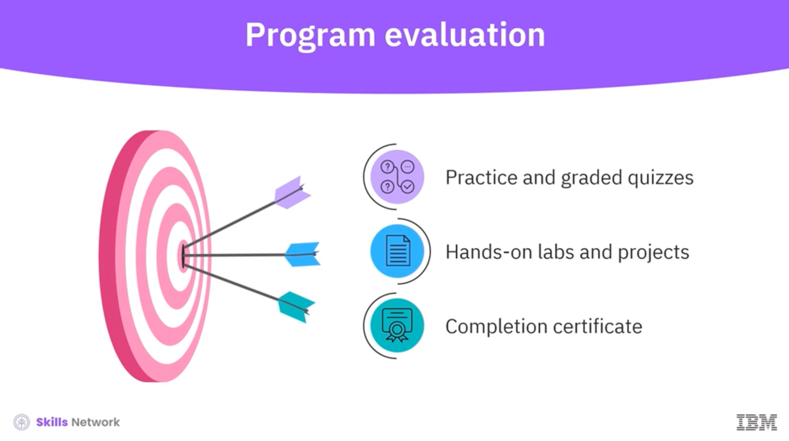

El programa incluye:
- Quizzes prácticos y evaluados
- Laboratorios hands-on
- Proyectos aplicados

Al completar satisfactoriamente todos los cursos y evaluaciones, obtendrás el **certificado oficial de IBM**, un credential reconocido por múltiples empleadores.

---

Ir al siguiente Materia:
[3. Course Overview](../3%20Course%20Overview/README.md)