## Introducción a la Inteligencia Artificial Generativa

Bienvenido al curso de **Introducción a la IA Generativa**. En esta sección, exploraremos la evolución de esta tecnología y aprenderemos a diferenciarla de los enfoques tradicionales.

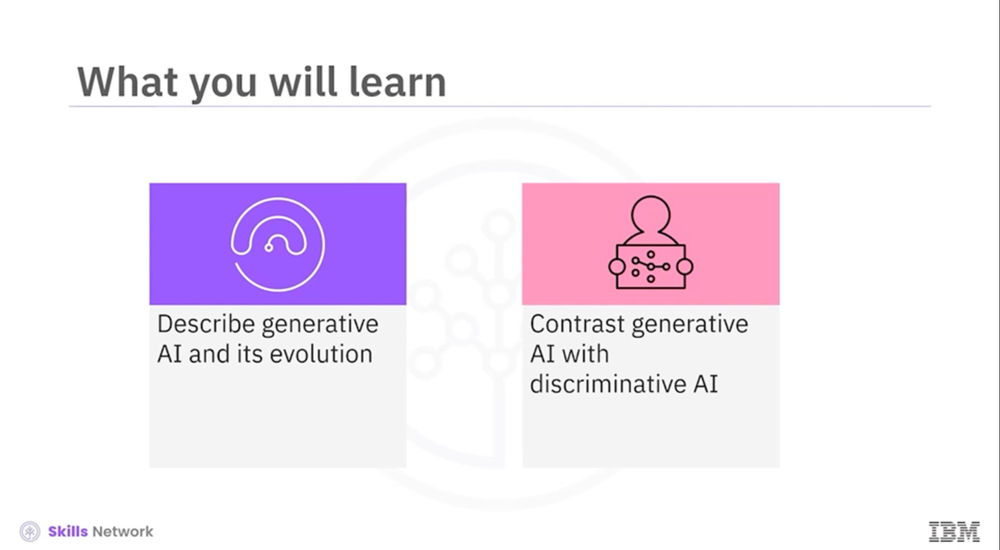

Al finalizar este video, podrás describir qué es la IA generativa y su evolución, además de explicar en qué se diferencia de la IA discriminativa.

---

### ¿Qué es la Inteligencia Artificial?

La Inteligencia Artificial (IA) ha estado presente durante años, transformando casi todos los aspectos de nuestra vida y revolucionando nuestra forma de vivir y trabajar.

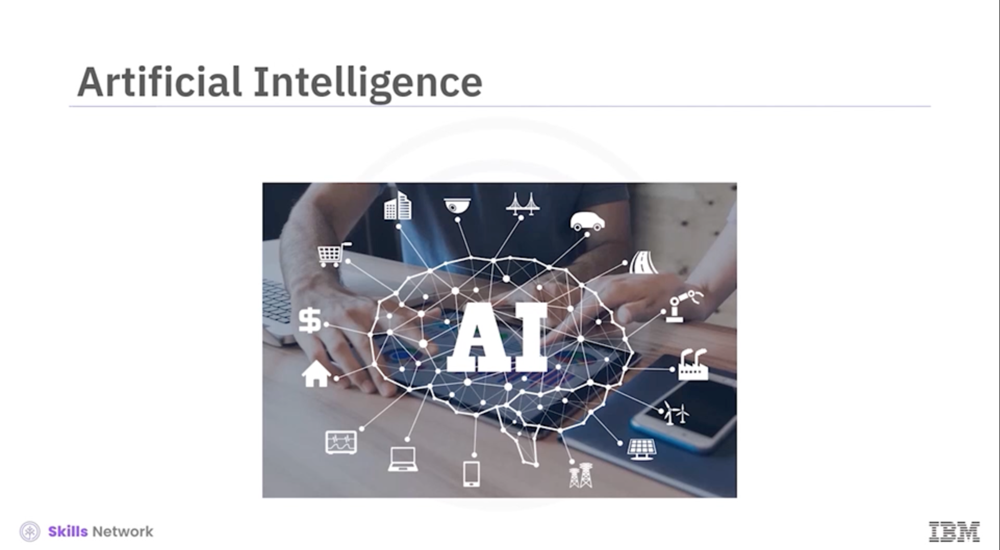

En su esencia, la IA puede definirse como la **simulación de la inteligencia humana por parte de las máquinas**.

---

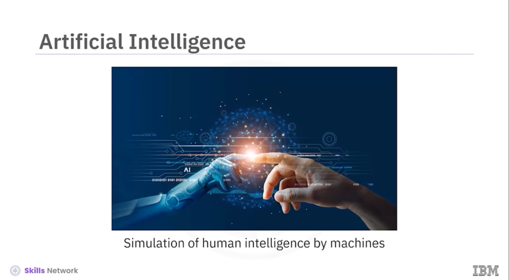

Los modelos de IA aprenden a partir de vastas cantidades de datos existentes. Este proceso de aprendizaje se conoce comúnmente como **entrenamiento**.

---

### Modelos de IA: Discriminativos vs. Generativos

Existen dos enfoques fundamentales en la IA: la **IA discriminativa** y la **IA generativa**.

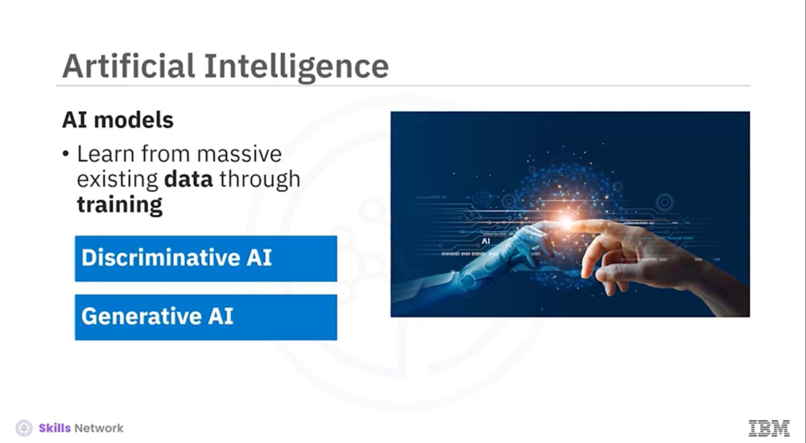

Mientras que ambos modelos aprenden de datos masivos, sus objetivos finales son opuestos.

---

#### IA Discriminativa
La IA discriminativa es un enfoque que aprende a **distinguir entre diferentes clases de datos**. En este modelo, cada punto de datos del entrenamiento está etiquetado con su clase respectiva.

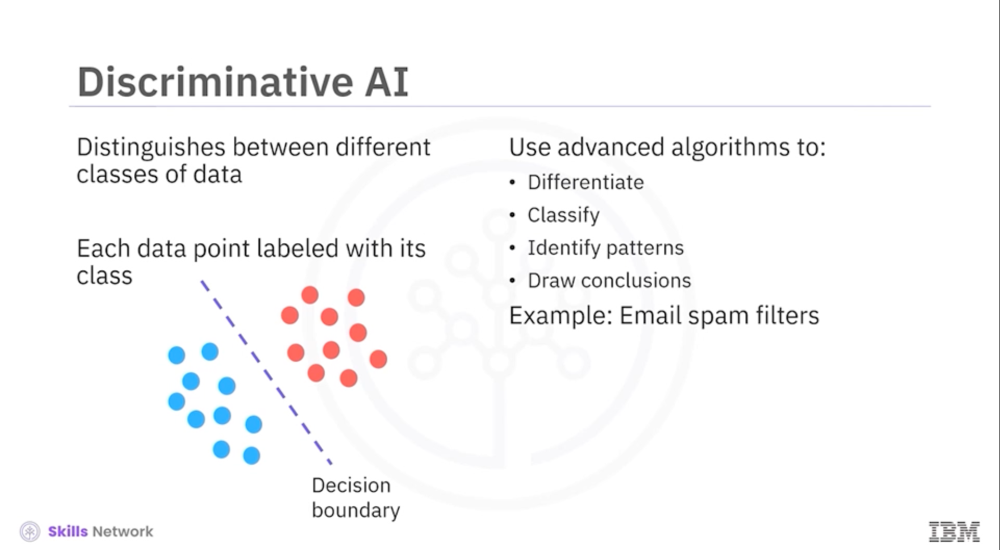

El modelo predice la clase de un nuevo dato encontrando de qué lado del "límite de decisión" (*decision boundary*) cae. Utiliza algoritmos avanzados para clasificar, identificar patrones y extraer conclusiones. Un ejemplo clásico son los **filtros de spam** de los correos electrónicos.

---

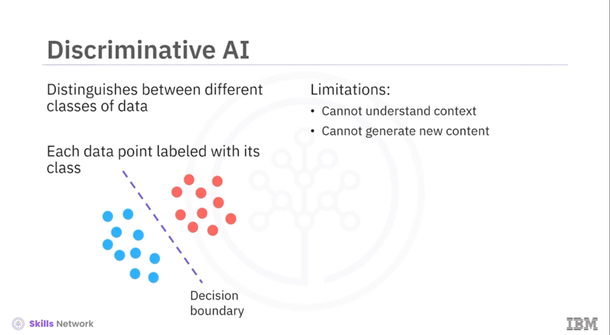

Aunque son excelentes para tareas de clasificación, estos modelos tienen limitaciones importantes: **no pueden entender el contexto ni generar contenido nuevo** basado en el conocimiento de los datos de entrenamiento.

---

#### IA Generativa
Aquí es donde entra la Inteligencia Artificial Generativa. A diferencia del modelo anterior, este enfoque busca crear.

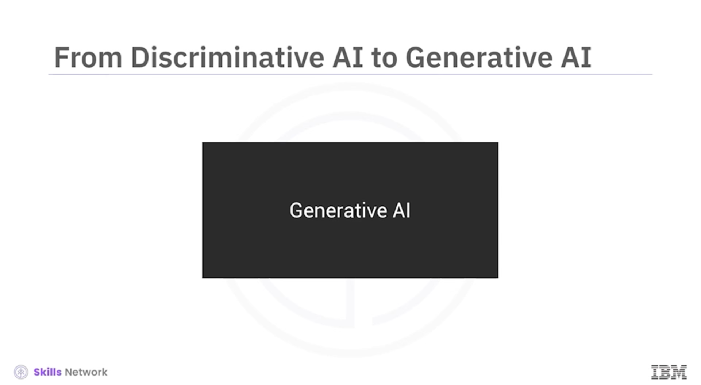

Los modelos de IA generativa aprenden a **generar nuevo contenido** basándose en los datos de entrenamiento previos.

---

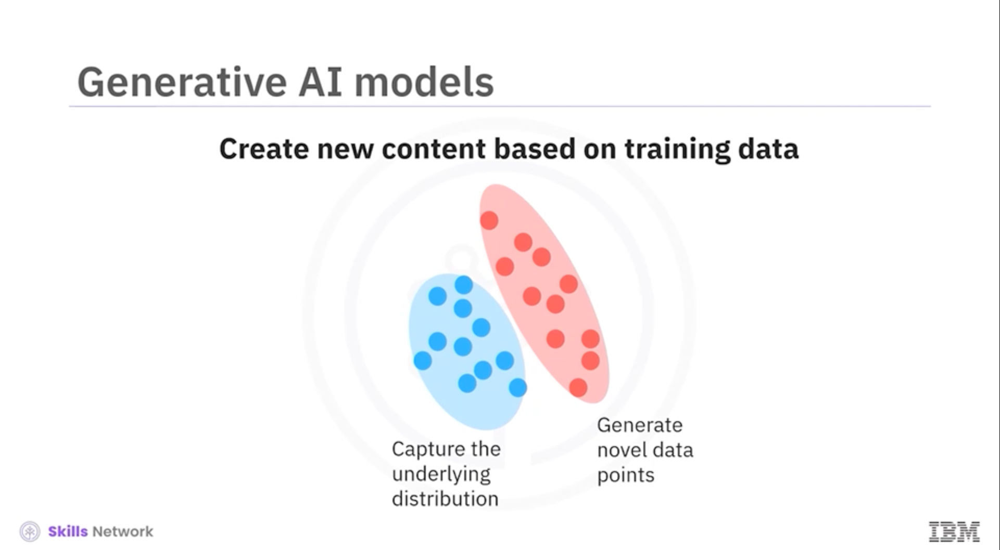

Estos modelos son capaces de capturar la distribución subyacente de los datos para generar instancias de datos completamente novedosas.

---

### Funcionamiento de la IA Generativa

Todo comienza con un **Prompt**. Este puede ser texto, una imagen, un video o cualquier otra entrada que el modelo pueda procesar.

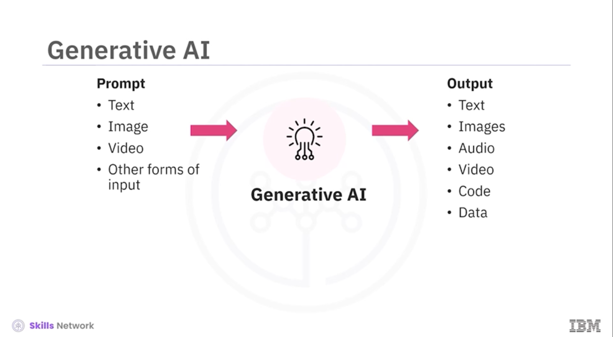

Como resultado, el modelo genera contenido nuevo que incluye texto, imágenes, audio, video, código y datos.

---

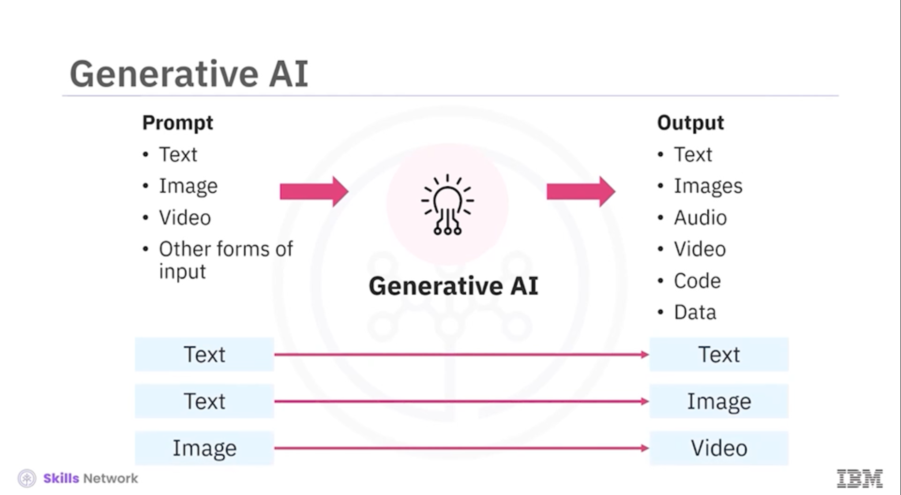

La IA generativa puede producir resultados en el mismo formato del prompt (como *text-to-text*) o en un formato distinto (como *text-to-image* o *image-to-video*).

## Diferencias Clave: IA Tradicional vs. Generativa

Para entender mejor la diferencia, podemos usar un ejemplo sencillo: mientras que la IA discriminativa es ideal para responder si una imagen es el dibujo de un nido o de un huevo, la IA generativa respondería a una instrucción como "dibuja un nido con tres huevos en él".

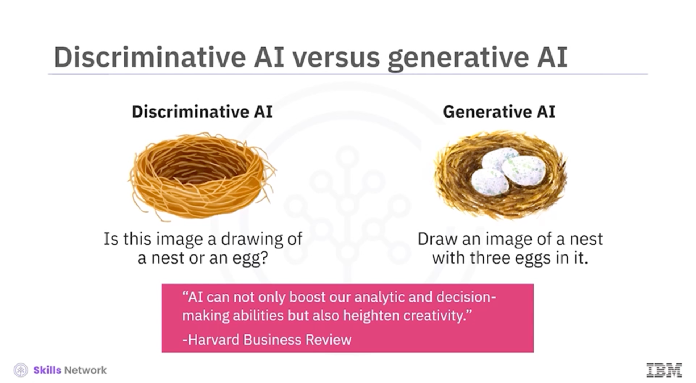

Mientras que la IA discriminativa imita nuestras habilidades analíticas y predictivas, la IA generativa va un paso más allá para imitar nuestras habilidades creativas. Como señala el *Harvard Business Review*, la IA no solo potencia nuestra toma de decisiones, sino que aumenta la creatividad.

---

### El Corazón de la IA: Deep Learning

Tanto los modelos discriminativos como los generativos se crean utilizando técnicas de **Deep Learning** (aprendizaje profundo), el cual entrena redes neuronales artificiales con vastas cantidades de datos.

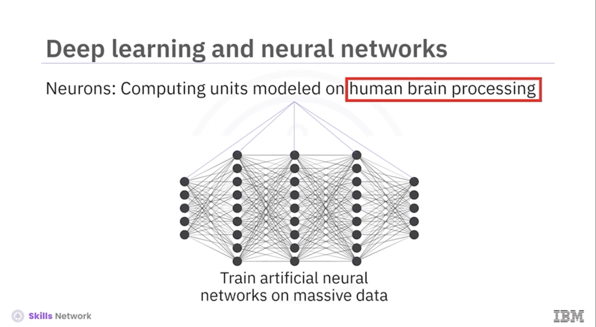

Una red neuronal artificial es una colección de unidades de computación llamadas **neuronas**, modeladas de forma similar a cómo el cerebro humano procesa la información.

---

### Bloques de Construcción de la Creatividad

La capacidad creativa de la IA proviene de modelos específicos que sirven como sus cimientos:
- **GANs** (Redes Generativas Antagónicas)
- **VAEs** (Autoencoders Variacionales)
- **Transformers**
- **Modelos de Difusión**

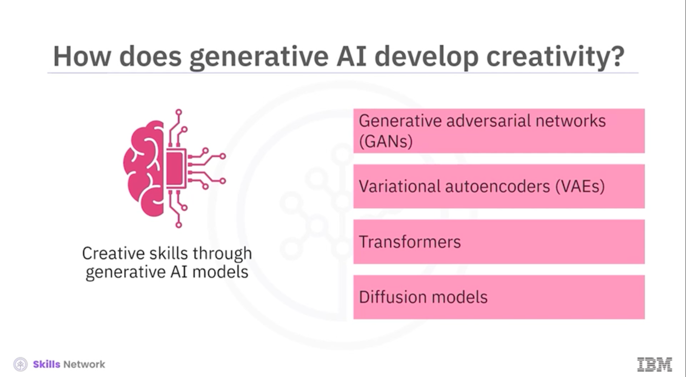

---

### Historia y Evolución

La IA generativa no es un concepto nuevo; sus raíces se remontan a los orígenes del **Machine Learning** a finales de los años 50.

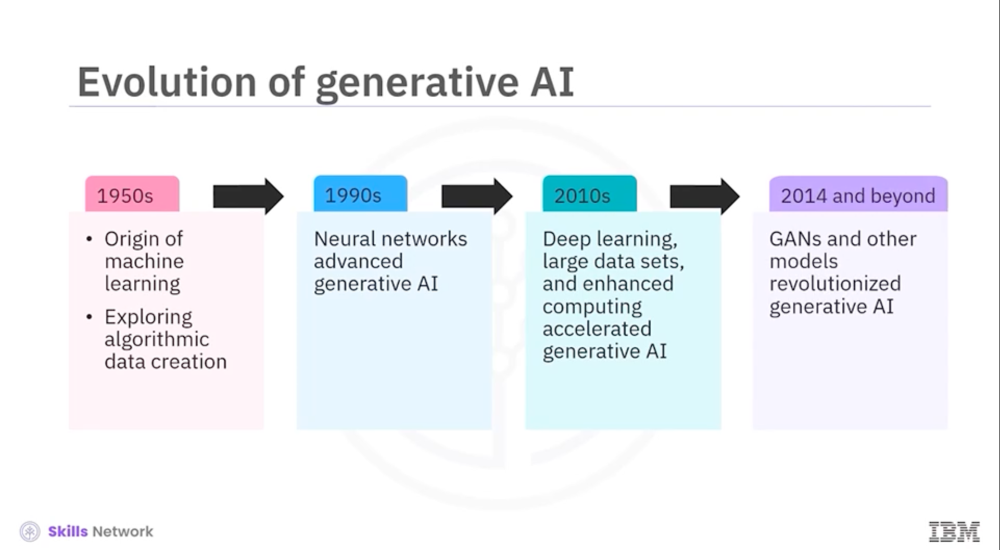

- **Años 90:** El auge de las redes neuronales impulsó los avances iniciales.
- **2010s:** El Deep Learning avanzó gracias a la disponibilidad de grandes conjuntos de datos y mayor potencia de cómputo.
- **2014:** Ian Goodfellow introdujo las **GANs**, transformando el campo por completo.

---

### Modelos Fundacionales y LLMs

Los **Modelos Fundacionales** son modelos con capacidades amplias que pueden adaptarse para crear herramientas especializadas para casos de uso específicos.

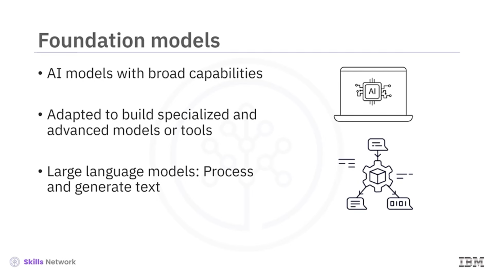

Una categoría específica son los **LLMs** (Modelos de Lenguaje Extensos), entrenados para entender y generar lenguaje humano. En 2018, OpenAI introdujo **GPT**, seguido por otros modelos como PaLM de Google y Llama de Meta.

---

### Herramientas y Aplicaciones del Mercado

El desarrollo de diversos modelos ha creado un mercado creciente de herramientas para múltiples propósitos:

| Uso | Herramientas Populares |
| :--- | :--- |
| **Texto** | ChatGPT, Gemini |
| **Imagen** | DALL-E, Midjourney, Stable Diffusion |
| **Video** | Synthesia |
| **Código** | Copilot, AlphaCode |

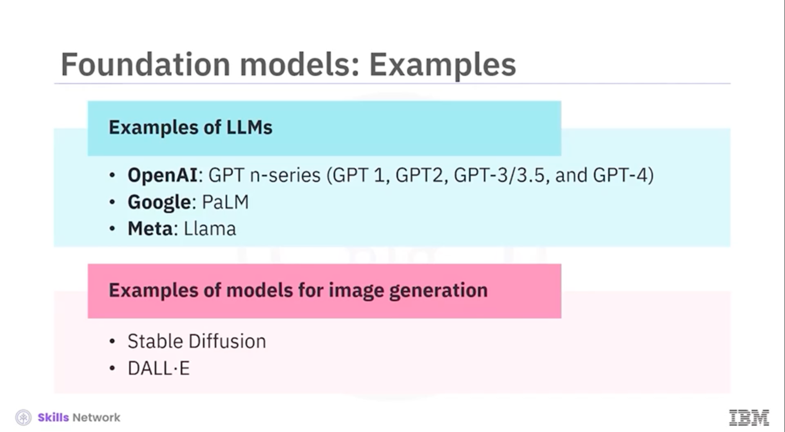

---

### El Impacto en el Trabajo y la Economía

Según informes de McKinsey, la IA generativa tiene el potencial de cambiar la anatomía del trabajo, aumentando las capacidades de los trabajadores mediante la automatización de actividades individuales.

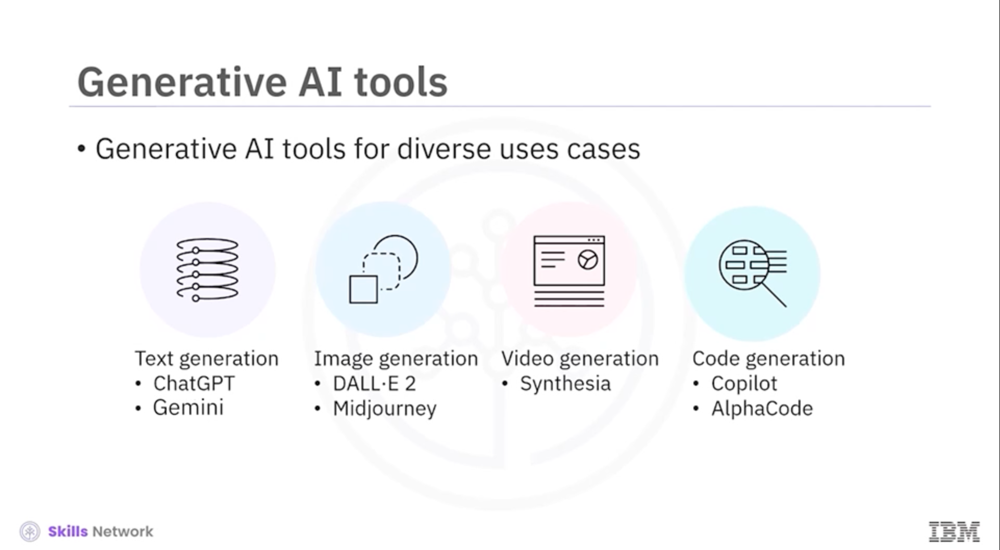

Se estima que su impacto en la productividad podría añadir **billones de dólares** en valor a la economía global, transformando industrias enteras.

---

### Aplicaciones en Diversos Dominios

La rápida aparición de modelos y herramientas ha generado un amplio alcance para las aplicaciones de IA generativa en múltiples dominios.

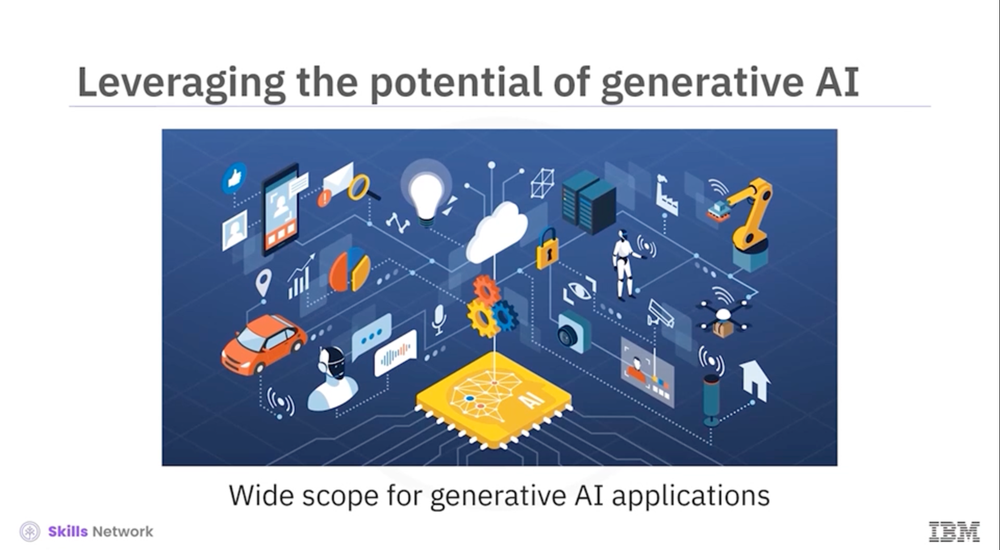

Citando el informe de McKinsey sobre el potencial económico de esta tecnología: "La IA generativa tiene el potencial de cambiar la anatomía del trabajo, aumentando las capacidades de los trabajadores individuales al automatizar algunas de sus actividades".

---

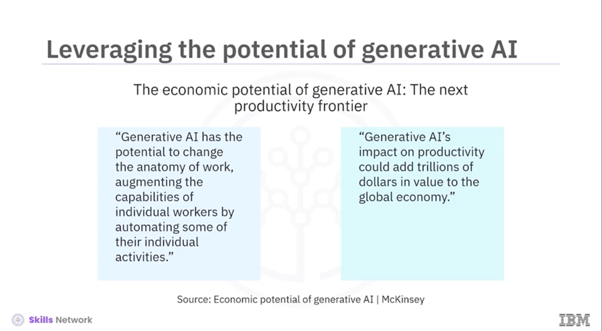

El informe también predice que el impacto de la IA generativa en la productividad podría añadir billones de dólares en valor a la economía global.

---

### Resumen del Módulo

En este video, hemos cubierto los conceptos fundamentales de esta tecnología:

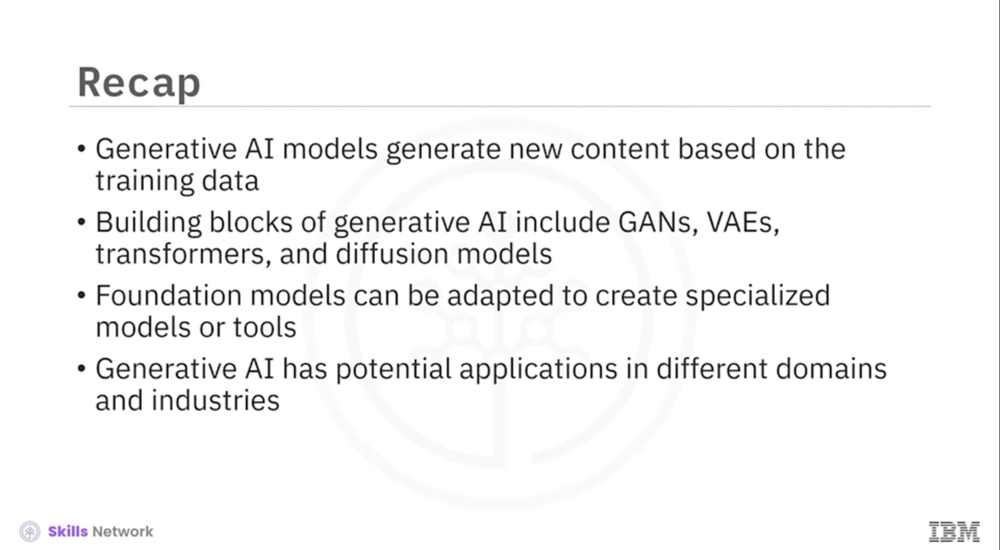

* **Capacidad de creación:** Los modelos de IA generativa crean contenido nuevo basado en los datos con los que fueron entrenados.
* **Arquitecturas clave:** Las habilidades creativas se construyen a partir de modelos como GANs, VAEs, transformers y modelos de difusión.
* **Modelos fundacionales:** Estos pueden adaptarse para crear herramientas especializadas según casos de uso específicos.
* **Impacto global:** Existe un vasto alcance para aplicaciones en diferentes industrias y sectores profesionales.

