## Modelos Fundacionales y LLMs en el Mundo Empresarial

En los últimos meses, los modelos de lenguaje extensos (LLMs), como ChatGPT, han revolucionado el mundo. Estamos viendo un cambio radical en el rendimiento de la IA y su potencial para generar valor empresarial.

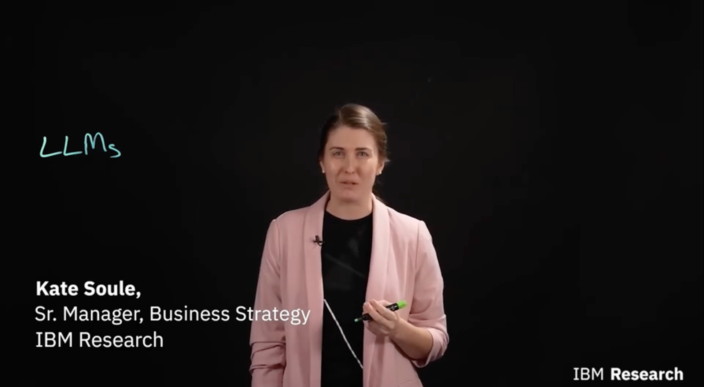

Mi nombre es Kate Soule, Gerente Senior de Estrategia de Negocios en IBM Research, y hoy daré una visión general de este nuevo campo de la IA y cómo se puede usar en entornos empresariales.

---

### El Cambio de Paradigma hacia los Modelos Fundacionales

Los LLMs son parte de una clase de modelos llamados **Modelos Fundacionales**. El término fue acuñado por un equipo de Stanford al observar que la IA estaba convergiendo hacia un nuevo paradigma.

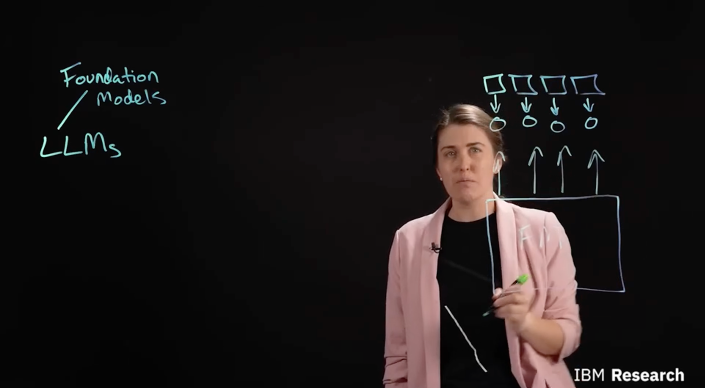

Antes, las aplicaciones de IA se construían entrenando modelos individuales con datos muy específicos para tareas muy concretas.

---

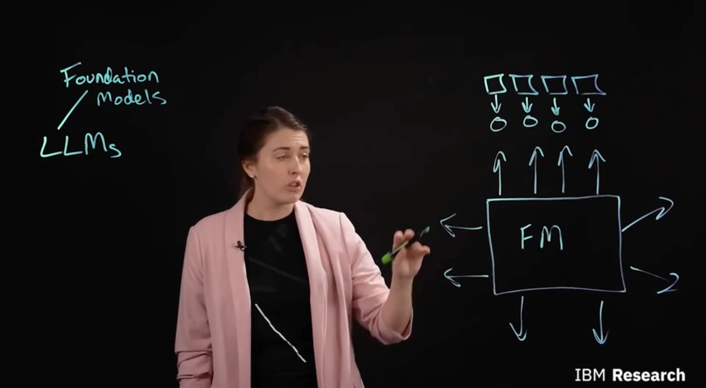

Ahora, nos movemos hacia un esquema donde una capacidad fundacional única impulsa los mismos casos de uso y muchas aplicaciones adicionales, gracias a su capacidad de transferencia.

---

### Entrenamiento con Datos Masivos

Lo que le da a estos modelos su "superpoder" es que han sido entrenados de manera no supervisada en cantidades masivas de datos no estructurados.

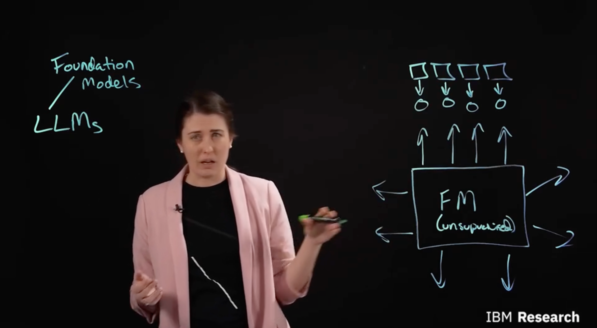

En el dominio del lenguaje, alimentamos al modelo con terabytes de datos para que aprenda a predecir la siguiente palabra en una oración, como completar "leche" después de "no llores sobre la derramada".

---

### IA Generativa y Adaptabilidad

Esta capacidad de predecir y generar la siguiente palabra es la razón por la que los modelos fundacionales pertenecen al campo de la **IA Generativa**.

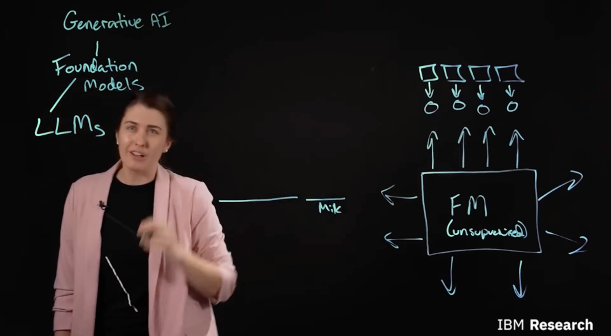

Aunque su tarea principal es generar contenido, estos modelos pueden adaptarse mediante un proceso llamado **Tuning** (ajuste) para realizar tareas tradicionales de NLP, como clasificación o reconocimiento de entidades.

---

### Tuning y Prompt Engineering

El **Tuning** implica introducir una pequeña cantidad de datos etiquetados para actualizar los parámetros del modelo para una función específica.

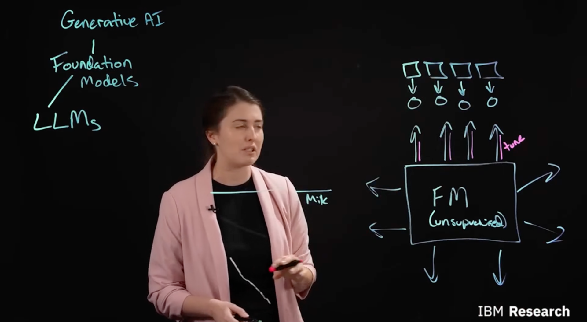

Si no tienes datos, puedes usar el **Prompt Engineering**. Al hacer una pregunta al modelo (como "¿este sentimiento es positivo o negativo?"), la respuesta será simplemente la continuación natural que el modelo genere.

---

### Ventajas: Rendimiento y Productividad

La principal ventaja de los modelos fundacionales es su alto rendimiento, ya que han sido entrenados con volúmenes masivos de datos.

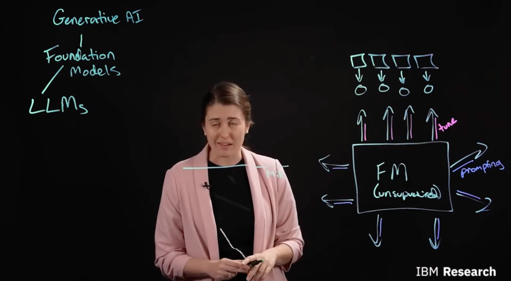

La segunda ventaja es el aumento de la productividad: se necesitan muchos menos datos etiquetados para lograr un modelo funcional comparado con empezar desde cero.

---

### Desafíos: Costos de Computación

Sin embargo, estos modelos tienen desventajas importantes. La primera es el costo de cómputo; son extremadamente caros de entrenar.

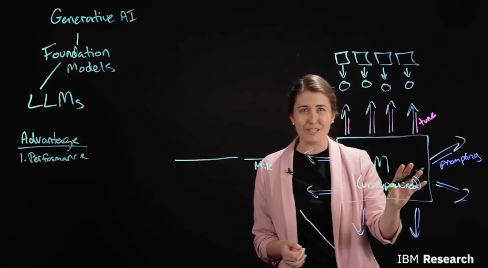

Esto hace que sea difícil para las empresas más pequeñas entrenar sus propios modelos fundacionales de manera independiente.

---

### Costos de Inferencia

Cuando los modelos alcanzan tamaños enormes de miles de millones de parámetros, también se vuelven costosos de ejecutar en el día a día.

Pueden requerir múltiples GPUs simultáneamente solo para alojarlos y procesar respuestas (inferencia), lo que los hace más costosos que los enfoques tradicionales.

---

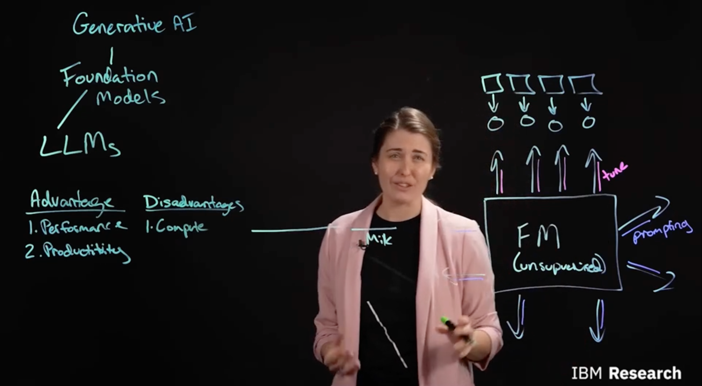

En conclusión, aunque los costos son elevados, las ganancias en rendimiento y productividad están transformando la manera en que las empresas implementan soluciones inteligentes.

## Desafíos de Confiabilidad y Futuro de los Modelos Fundacionales

Además de los costos, existe un segundo desafío crítico: la **confiabilidad** (*trustworthiness*). Aunque la cantidad masiva de datos es una ventaja, también tiene un costo oculto, especialmente en el lenguaje.

Muchos de estos modelos se entrenan con datos extraídos de Internet. Es tal la cantidad de información que, incluso con un equipo de humanos, sería imposible revisar cada punto de datos para asegurar que no contenga sesgos, lenguaje de odio o información tóxica.

---

### Transparencia en los Datos

A menudo, en los modelos de código abierto, ni siquiera se sabe con exactitud qué conjuntos de datos se utilizaron para el entrenamiento, lo que genera dudas sobre su seguridad y fiabilidad en entornos corporativos.

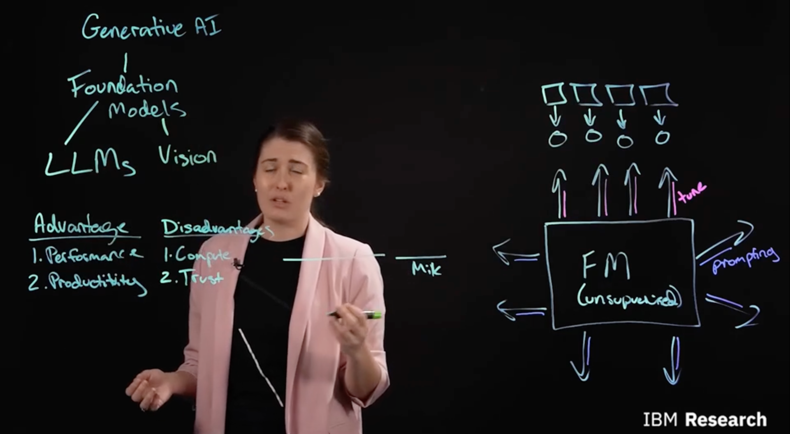

IBM Research está trabajando en innovaciones para mejorar la **eficiencia, confiabilidad y responsabilidad** de estos modelos, haciéndolos más aptos para el uso empresarial profesional.

---

### Más allá del Lenguaje: Otros Dominios

Aunque hemos hablado mucho de texto, los modelos fundacionales se están aplicando a múltiples campos con resultados sorprendentes:

* **Visión:** Modelos como **DALL-E 2** que generan imágenes a partir de texto.
* **Código:** Herramientas como **Copilot** que ayudan a completar código mientras se escribe.

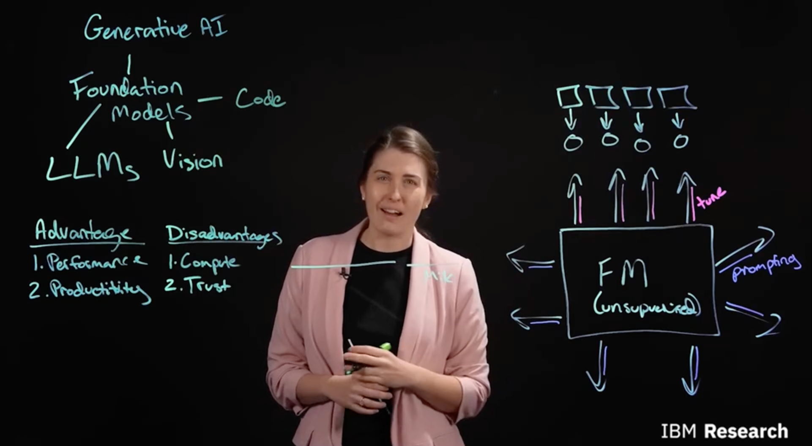

---

### Innovación en IBM y Casos de Uso Reales

IBM está integrando modelos fundacionales en todo su ecosistema de productos para maximizar el valor en distintos sectores:

* **Watson Assistant y Discovery:** Potenciados con modelos de lenguaje.
* **Maximo Visual Inspection:** Utilizando modelos de visión para inspección industrial.
* **Project Wisdom (con Red Hat):** Modelos de código específicos para Ansible.

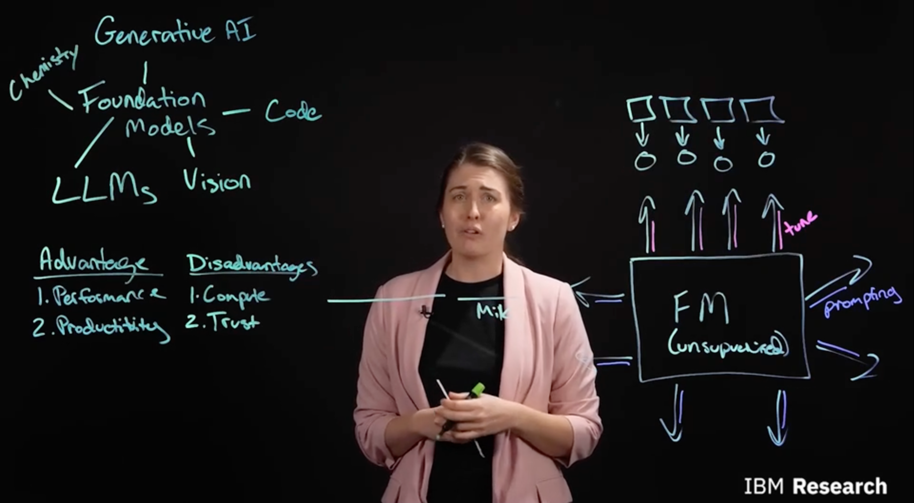

---

### Ciencia y Medio Ambiente

El alcance de esta tecnología llega incluso a la ciencia pura y la lucha contra el cambio climático:

1.  **Química:** Se ha lanzado **Moleformer**, un modelo fundacional para el descubrimiento de moléculas y nuevas terapias dirigidas.
2.  **Clima:** Creación de modelos fundacionales de **ciencias de la Tierra** utilizando datos geoespaciales para mejorar la investigación climática.

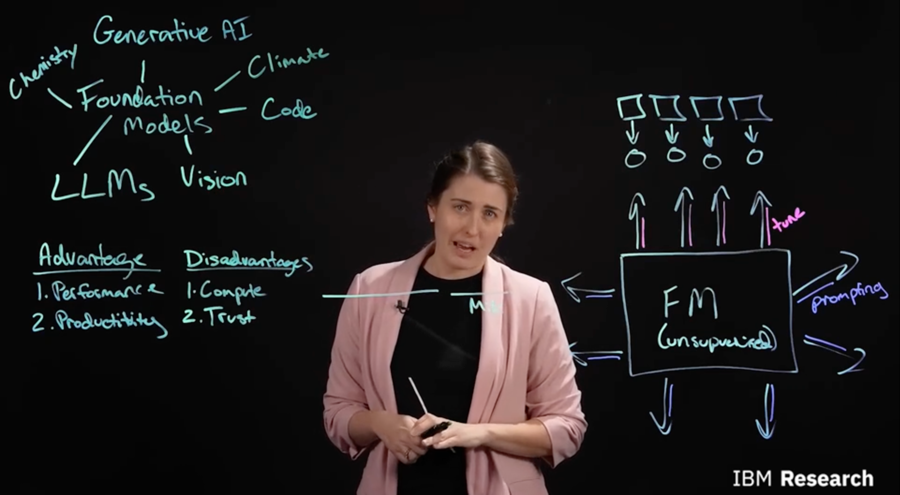

---

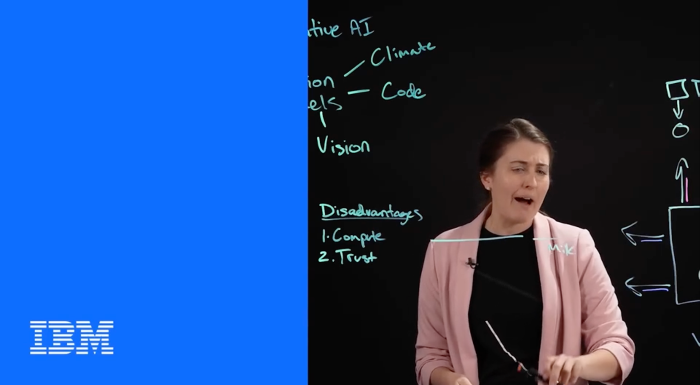

Los modelos fundacionales están redefiniendo lo que es posible. Si bien existen desafíos en términos de costo y sesgos, la capacidad de adaptar una sola base para resolver problemas en medicina, programación y ecología marca el inicio de una nueva era en la inteligencia artificial.
