# Clase: Introducción al Procesamiento de Lenguaje Natural (NLP)

El Procesamiento de Lenguaje Natural o **NLP** es, en esencia, lo que estás haciendo justo ahora: escuchar palabras y oraciones para extraer comprensión. Cuando le pedimos a una computadora que haga lo mismo, estamos hablando de NLP.

### Datos No Estructurados vs. Estructurados

El punto de partida del NLP es el **texto no estructurado**. Esto es simplemente la forma en que los humanos hablamos (ej. *"Añade huevos y leche a mi lista de compras"*). Aunque nosotros lo entendemos, una computadora necesita una **representación estructurada** (como un archivo JSON o XML) para procesarlo.

El trabajo del NLP es actuar como traductor entre estos dos mundos:
* **NLU (Natural Language Understanding):** De datos no estructurados a estructurados.
* **NLG (Natural Language Generation):** De datos estructurados a lenguaje humano (no estructurado).

---

### Casos de Uso Principales

#### 1. Traducción Automática
No se trata solo de cambiar palabras de un idioma a otro, sino de entender el **contexto**. 

> **⚠️ Ejemplo de error de contexto:** > La frase *"El espíritu es fuerte, pero la carne es débil"* traducida al ruso y de vuelta al inglés terminó como *"El vodka es bueno, pero la carne está podrida"*. El NLP ayuda a evitar estas interpretaciones literales erróneas.

#### 2. Asistentes Virtuales y Chatbots
Ya sea mediante voz (Siri, Alexa) o texto, el NLP permite derivar comandos a ejecutar o recorrer árboles de decisión para realizar acciones basadas en lo que el usuario dice.

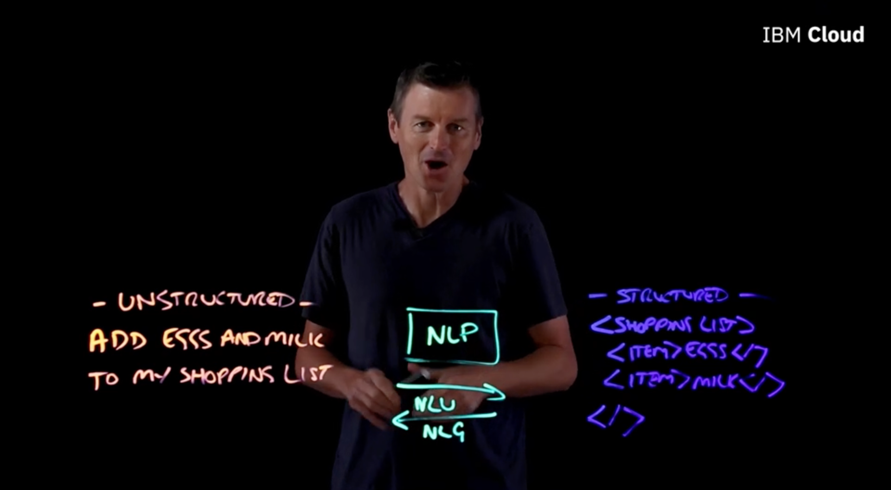

---

#### 3. Análisis de Sentimiento
Consiste en analizar un texto (como una reseña de producto) para determinar si la intención es positiva, negativa, seria o incluso sarcástica.

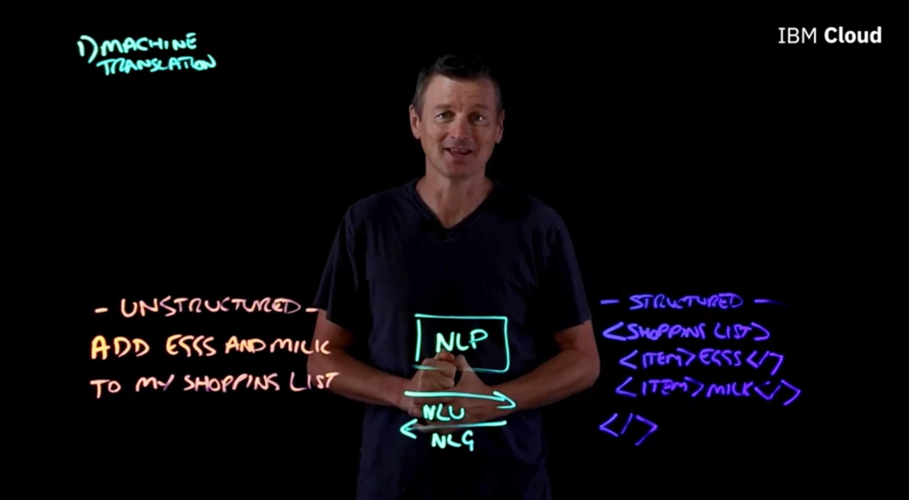

#### 4. Detección de Spam
El NLP busca indicadores como gramática pobre, palabras sobreutilizadas o falsos reclamos de urgencia para decidir si un correo es legítimo o basura.

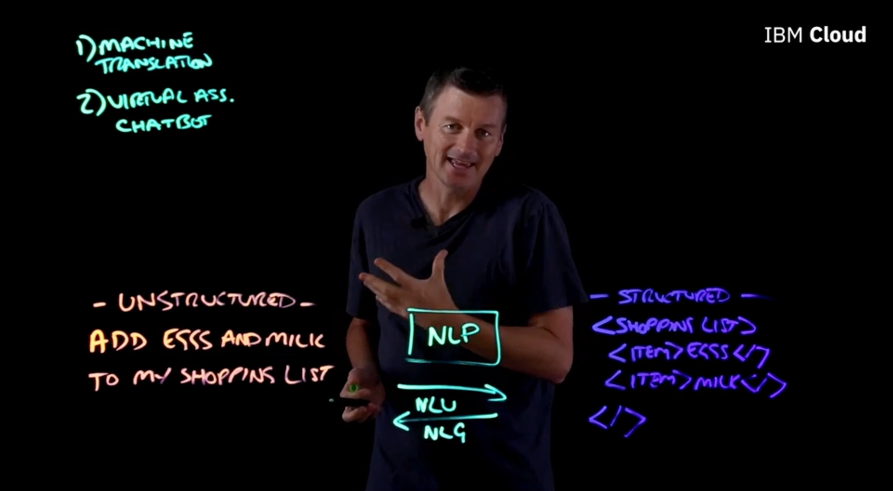

---

### ¿Cómo funciona el NLP? (La Caja de Herramientas)

El NLP no es un solo algoritmo, sino un conjunto de herramientas que se aplican paso a paso. El proceso comienza con texto escrito (o voz convertida a texto).

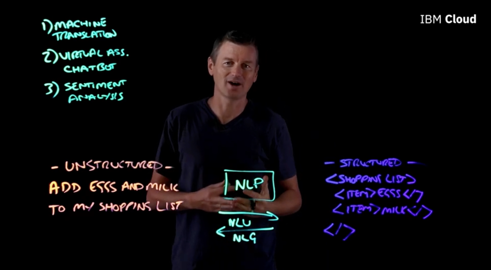

#### Paso 1: Tokenización
Es el proceso de romper una cadena de texto en pedazos llamados **tokens**. Por ejemplo, la frase *"Añade huevos y leche a mi lista"* se divide en 8 tokens individuales.

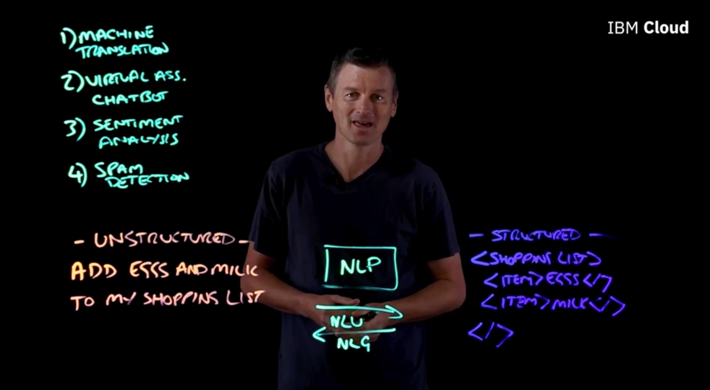

#### Paso 2: Stemming (Derivación)
Se trata de encontrar la raíz de una palabra. Por ejemplo, las palabras *"corriendo"*, *"corre"* y *"corrió"* se normalizan a su raíz: **"correr"**. Esto ayuda a la computadora a entender que todas se refieren al mismo concepto eliminando prefijos y sufijos.

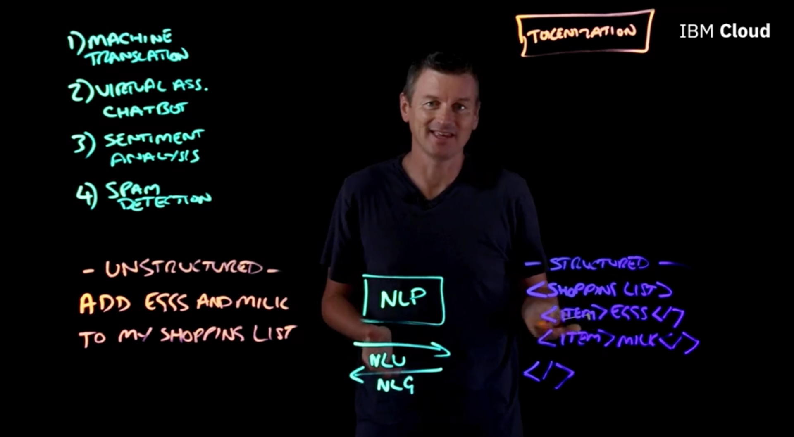

---

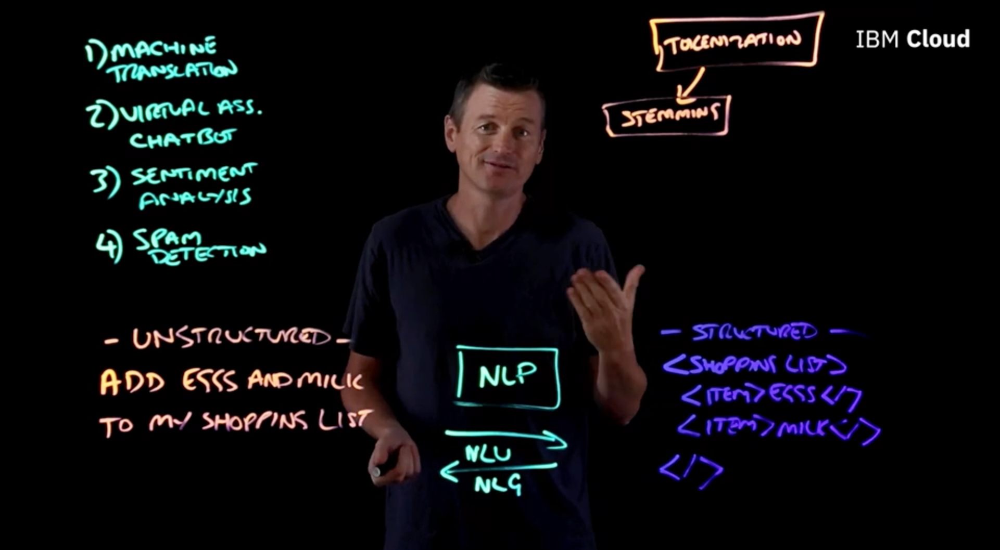

> 💡 **Nota:** > Aunque el **Stemming** es rápido porque simplemente "corta" el final de las palabras siguiendo reglas fijas, a veces comete errores (como cortar "computadora" a "comput"). Por eso, en sistemas más avanzados se usa la **Lematización**, que utiliza un diccionario real para asegurar que la raíz tenga sentido lingüístico. Es como comparar un hacha (Stemming) contra un bisturí (Lematización).

---

---

### Herramientas Avanzadas de Análisis

Como vimos, el **Stemming** tiene limitaciones con palabras como "universal" o "universidad". Para esos casos, usamos herramientas más precisas.

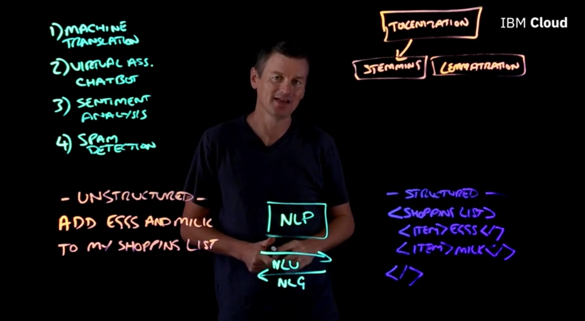

#### Paso 3: Lematización (Lemmatization)
A diferencia del stemming, la lematización consulta un diccionario para entender el significado real. Por ejemplo:
* La raíz (lema) de la palabra **"mejor"** es **"bueno"**. 
* Si usáramos stemming en inglés con "better", obtendríamos "bet", lo cual cambia totalmente el sentido. La lematización asegura que conservemos la esencia semántica.

---

#### Paso 4: Etiquetado de Partes del Discurso (Part of Speech Tagging)
Esta herramienta analiza cómo se usa un token dentro del contexto de una oración. La función de una palabra puede cambiar drásticamente:

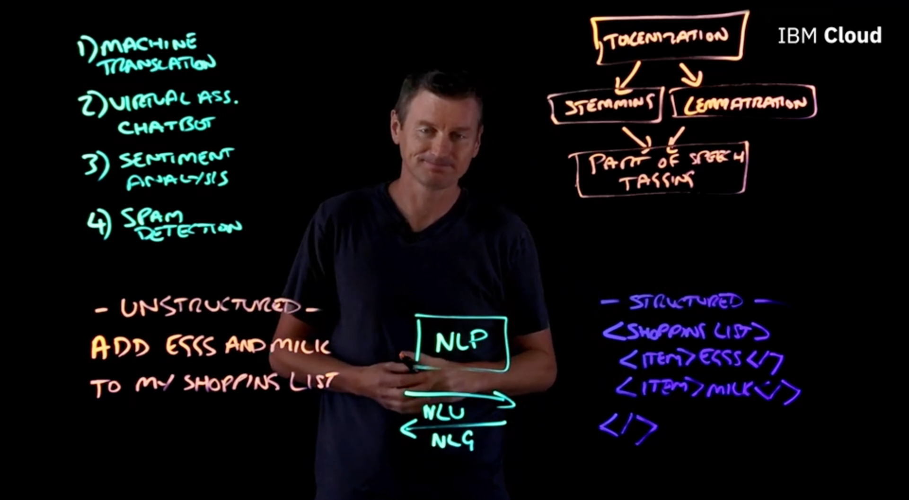

* En *"Voy a **hacer** (make) la cena"*, la palabra es un **verbo**.
* En *"¿De qué **marca** (make) es tu laptop?"*, la palabra funciona como un **sustantivo**. El etiquetado ayuda a la IA a no confundir estas funciones.

---

#### Paso 5: Reconocimiento de Entidades Nombradas (Named Entity Recognition - NER)
El último paso de nuestra "bolsa de herramientas" identifica si un token representa una entidad específica del mundo real.

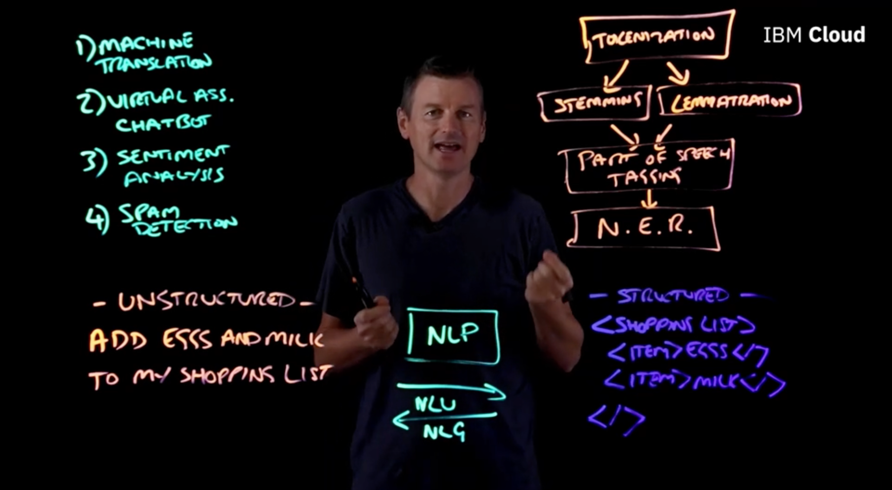

* El token **"Arizona"** se identifica como una entidad de **Estado/Ubicación**.
* El token **"Ralph"** se identifica como una entidad de **Persona**.

---

### Conclusión: De lo Humano a lo Digital

Al aplicar todos estos pasos (tokenización, lematización, etiquetado y NER), logramos transformar el habla humana desordenada en datos estructurados que cualquier aplicación de IA puede procesar y ejecutar.

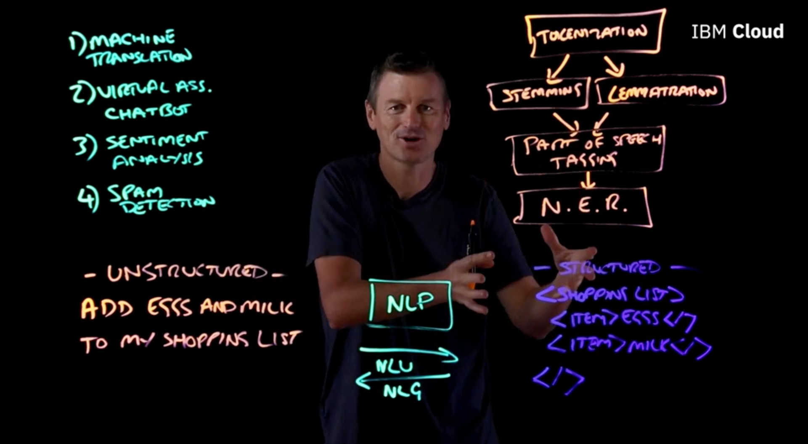

> 💡 **Nota de Gemini:**
> Un detalle fascinante es que el **NER** (Reconocimiento de Entidades) es lo que permite que cuando le dices a tu teléfono "Llama a Juan", la IA sepa que "Juan" no es una palabra cualquiera, sino un objeto de tipo "Contacto". Sin esta capa, la IA entendería la gramática, pero no sabría con qué elementos de tu vida real interactuar.

---