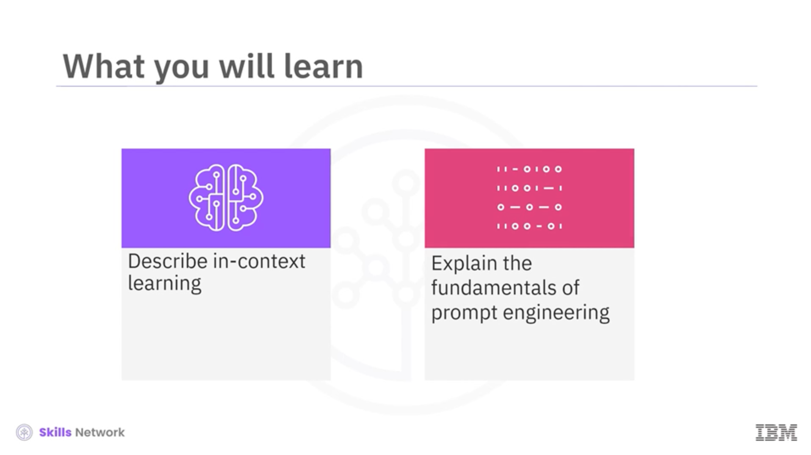
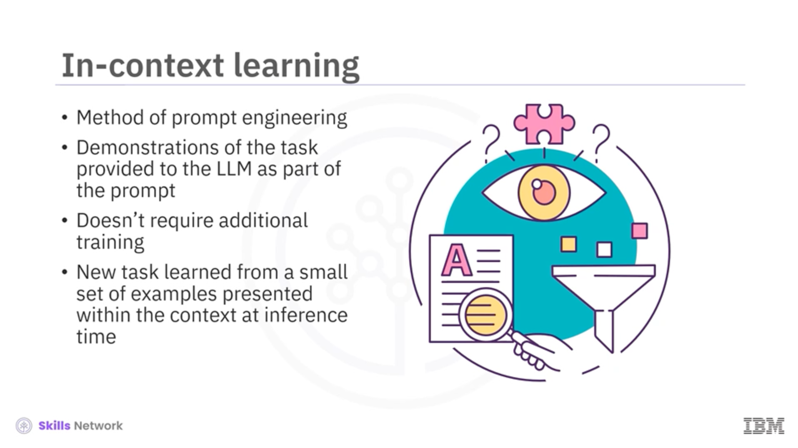
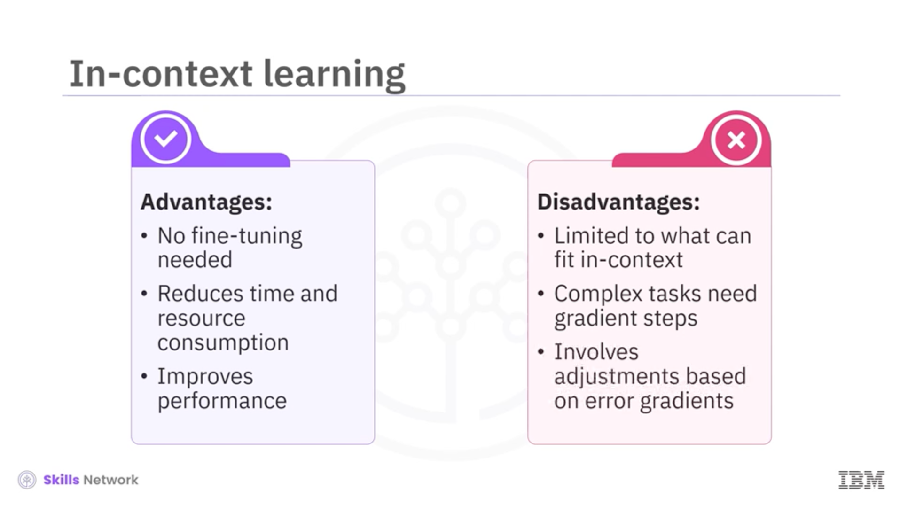
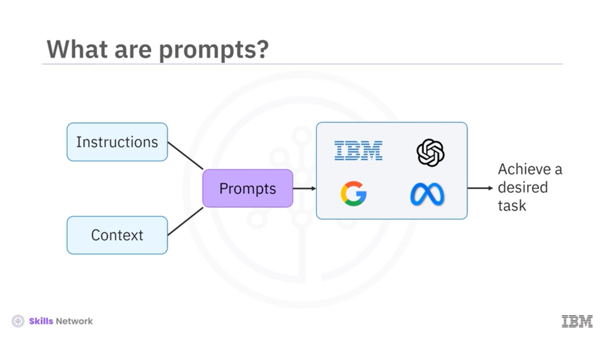
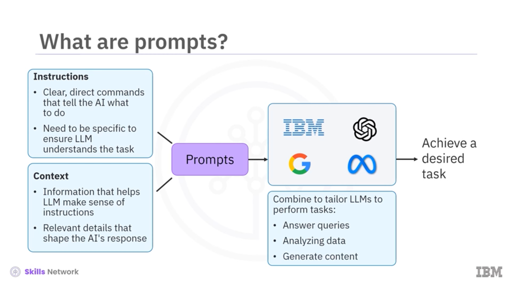
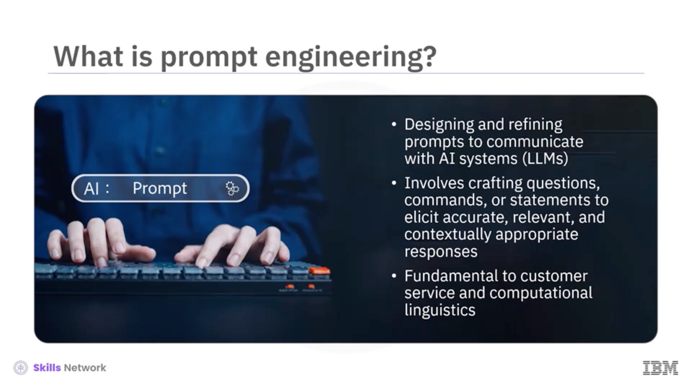
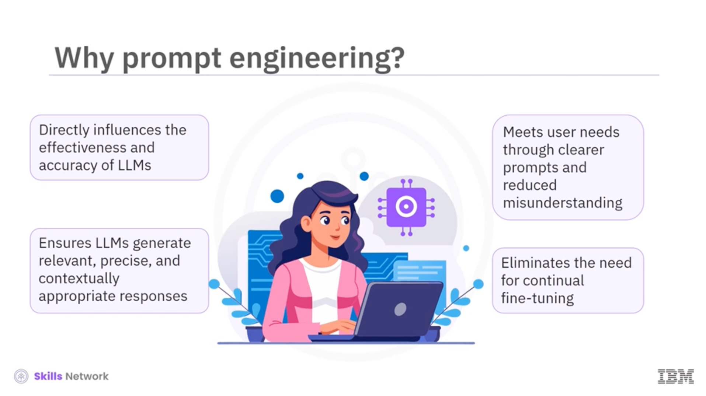
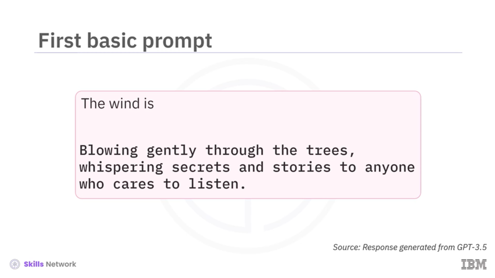
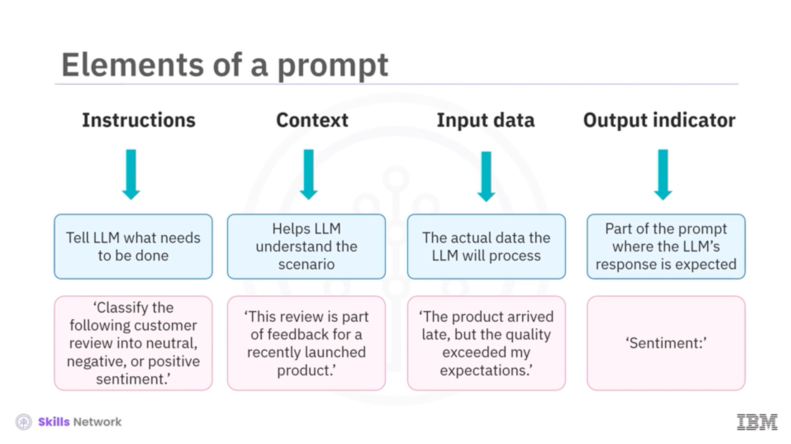
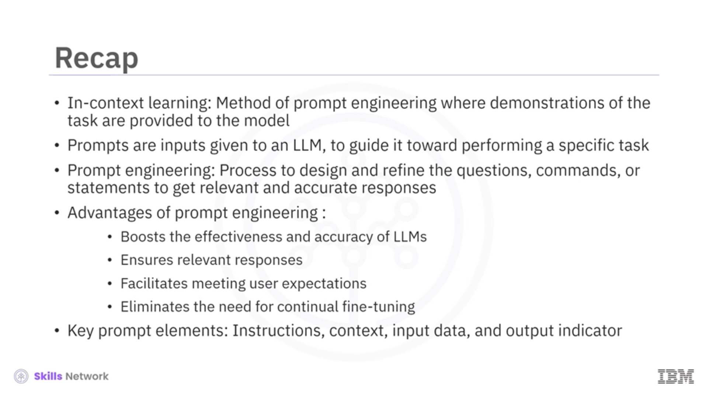

# Clase: Introducción al In-context Learning y Prompt Engineering

Bienvenido a la introducción al **In-context Learning**. En este video, aprenderás a describir este método y los fundamentos de la ingeniería de prompts.

---
El **In-context Learning** es un método específico de ingeniería de prompts donde se proporcionan demostraciones de la tarea al modelo como parte del prompt en lenguaje natural. No requiere entrenamiento adicional; la tarea se aprende a partir de ejemplos presentados en el contexto durante el tiempo de inferencia.

---

### Ventajas y Desventajas

Este método no requiere que el modelo sea ajustado (*fine-tuned*) en conjuntos de datos específicos, lo que reduce drásticamente los recursos y el tiempo necesarios para adaptar los LLMs.

Sin embargo, tiene limitaciones: está restringido por lo que puede caber en el contexto. Las tareas muy complejas podrían seguir requiriendo pasos de gradiente o enfoques de aprendizaje automático tradicionales que ajusten los pesos del modelo.

---

### ¿Qué es un Prompt?

Los **prompts** son instrucciones o entradas dadas a un LLM diseñadas para guiarlo a realizar una tarea específica. Tienen dos componentes principales: **Instrucciones** (comandos directos) y **Contexto** (información de fondo).

Al combinar estos elementos, puedes adaptar modelos de IBM, OpenAI, Google o Meta para tareas que van desde responder consultas hasta generar contenido complejo.

---

### Definición de Prompt Engineering

La **Ingeniería de Prompts** es el proceso especializado de diseñar y refinar las preguntas o comandos para interactuar con sistemas de IA.

El objetivo no es solo preguntar, sino hacerlo de la mejor manera posible, creando prompts claros y ricos en contexto para obtener las respuestas más precisas. Es fundamental en campos como la automatización del servicio al cliente y la lingüística computacional.

---

### Importancia de la Ingeniería de Prompts

Este proceso es crucial porque mejora la efectividad y precisión de los LLMs, asegura la relevancia de las respuestas y reduce los malentendidos al cumplir mejor las expectativas del usuario.

Además, permite que el modelo se adapte y aprenda dentro de su propio contexto, eliminando la necesidad de un re-entrenamiento constante.

---

### Ejemplo Práctico

Aquí vemos un ejemplo simple con GPT-3.5. Al proveer el inicio: *"The wind is..."*, el modelo genera una respuesta poética y detallada.

Esto demuestra cómo un prompt abierto guía al LLM para crear contenido creativo y atractivo, resaltando su capacidad de generación.

---

### Anatomía de un Prompt Estructurado (1/2)

Desglosemos los componentes de un prompt bien estructurado. Primero tenemos las **Instrucciones** y el **Contexto**.

* **Instrucción:** "Clasifica la reseña en neutral, negativa o positiva".
* **Contexto:** Indica que la reseña es parte del feedback de un producto recién lanzado, lo que ayuda al modelo a ponderar el análisis.

---

### Anatomía de un Prompt Estructurado (2/2)

Los siguientes componentes son los **Datos de Entrada** y el **Indicador de Salida**.

* **Input Data:** Es el texto real a procesar (ej: "El producto llegó tarde pero la calidad excedió mis expectativas").
* **Output Indicator:** Es el marcador final (ej: "Sentiment:") que le indica a la IA dónde debe entregar su análisis.

---

### Resumen de Conceptos Clave

En resumen, los prompts consisten en instrucciones y contexto, y la ingeniería de prompts es el arte de refinarlos para obtener resultados óptimos.

> 💡 **Nota de Gemini:** > Un truco de experto es usar delimitadores (como `###` o `"""`) para separar claramente las **Instrucciones** de los **Datos de Entrada**. Esto ayuda al modelo a no confundir la orden con el contenido que debe analizar.

---

### Conclusión del Módulo

Has aprendido que el In-context Learning permite al modelo adaptarse sin fine-tuning y que un prompt robusto se basa en cuatro elementos: instrucciones, contexto, datos e indicador de salida.

