Bienvenido a esta introducción a LangChain. Después de ver este video, podrás:
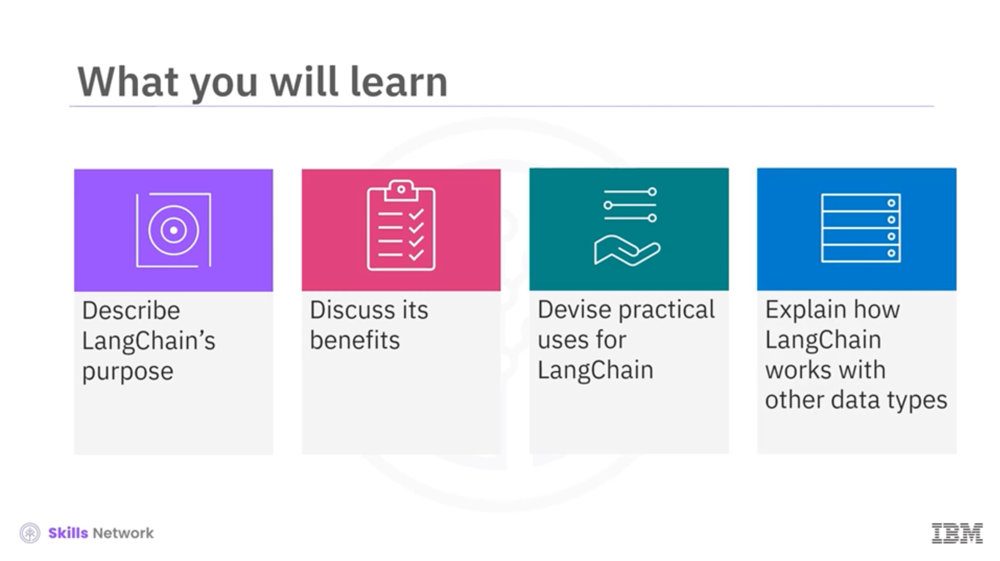
- describir el propósito de LangChain, 
- analizar sus beneficios, 
- idear usos prácticos para LangChain 
- explicar cómo funciona con otros tipos de datos. 
---

El framework de código abierto de Python LangChain agiliza el desarrollo de aplicaciones de modelos de lenguaje grandes (LLM). 
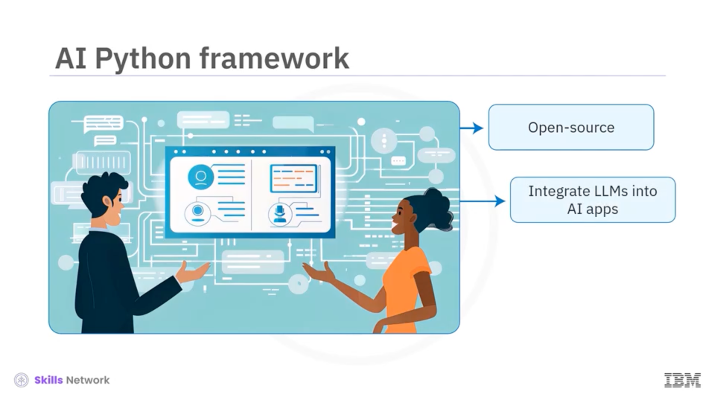
LangChain proporciona a los desarrolladores componentes e interfaces para facilitar la integración de LLM en sus aplicaciones 
de IA. 
---

El framework se utiliza para identificar información relevante en textos, como artículos de investigación o documentos legales. 
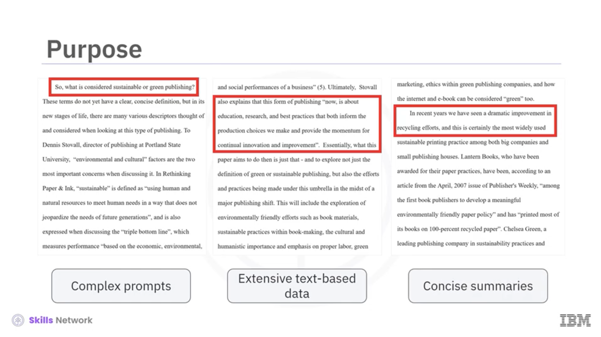

También proporciona métodos para responder a solicitudes complejas mediante la recuperación de datos y la generación de 
un resumen coherente. 
---

Encadena las operaciones de recuperación, extracción, procesamiento y generación a partir de grandes cantidades de texto 
y múltiples fuentes, de ahí la palabra "cadena" (chain) en su nombre.

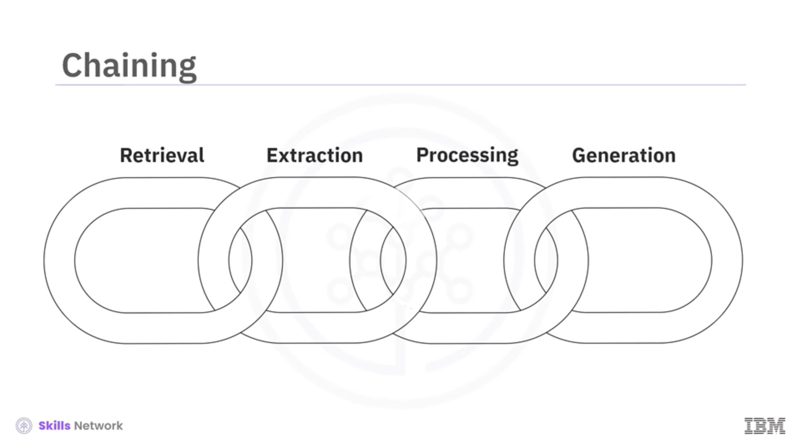
---

Los desarrolladores de IA prefieren este framework por sus diversas ventajas clave, como su modularidad, extensibilidad 
y capacidad de descomposición. Además, se integra fácilmente con bases de datos vectoriales. Analicemos cada una de ellas. 

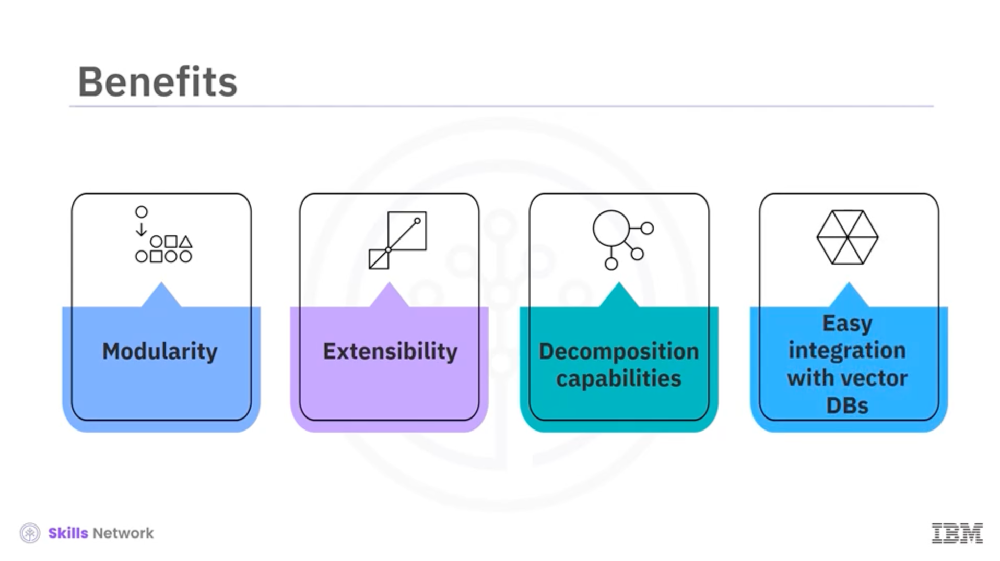
---

El diseño de LangChain permite a los desarrolladores de aplicaciones ensamblar diferentes componentes como bloques de 
construcción. Esta modularidad también fomenta la reutilización de componentes, reduciendo el tiempo y el esfuerzo de desarrollo. 
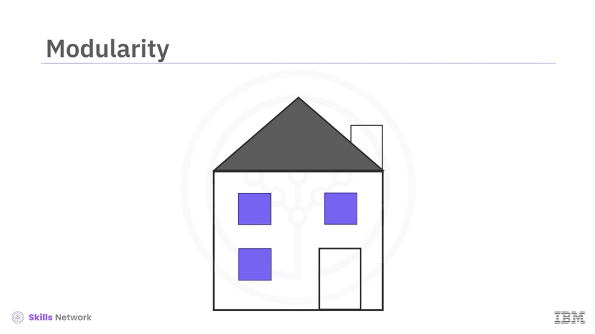
---
El diseño extensible de LangChain permite a los desarrolladores añadir fácilmente nuevas funciones, adaptarse a componentes 
existentes, integrarse con sistemas externos y realizar cambios mínimos en sus bases de código. 

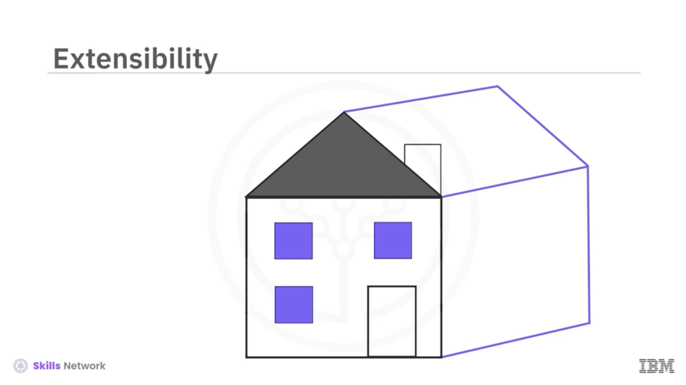
---

LangChain imita el proceso humano de resolución de problemas al descomponer consultas o tareas complejas en pasos más 
pequeños y manejables. Esta capacidad de descomposición le permite realizar inferencias precisas a partir del contexto, 
lo que resulta en respuestas relevantes y precisas. 

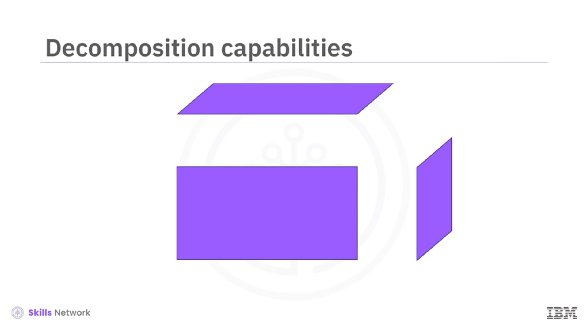
---

LangChain se integra con bases de datos vectoriales para realizar búsquedas semánticas y recuperar información de forma 
eficiente.

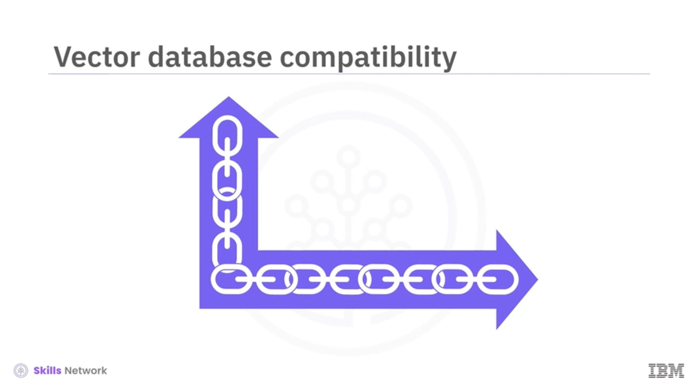

Al utilizarse junto con bases de datos vectoriales, proporciona a las aplicaciones acceso rápido a información relevante 
dentro de amplios conjuntos de datos. 

---

Las aplicaciones de IA pueden aprovechar el framework LangChain para diversos usos prácticos, como el resumen de contenido, 
la extracción de datos, sistemas sofisticados de preguntas y respuestas y la generación automatizada de contenido. 

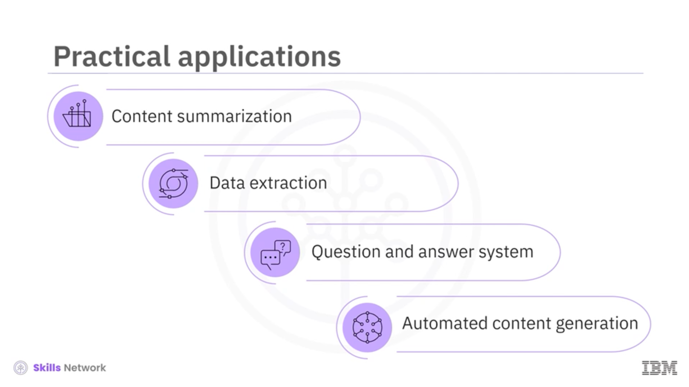

Exploremos un ejemplo específico de cada uno.

---

Gracias a su capacidad para resumir artículos, informes y documentos, los usuarios pueden mantenerse mejor informados al 
descifrar el significado de documentos legales complejos. 

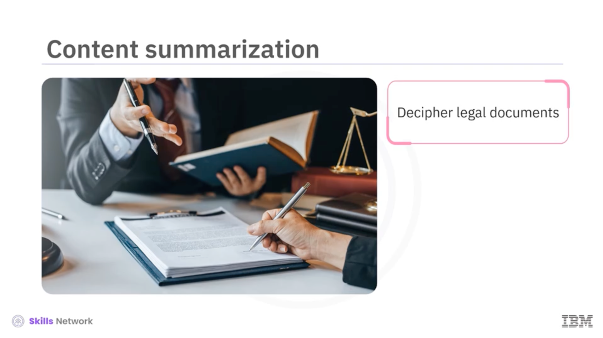
---

Puede extraer estadísticas clave de los informes, simplificando el proceso de convertir texto en información útil.

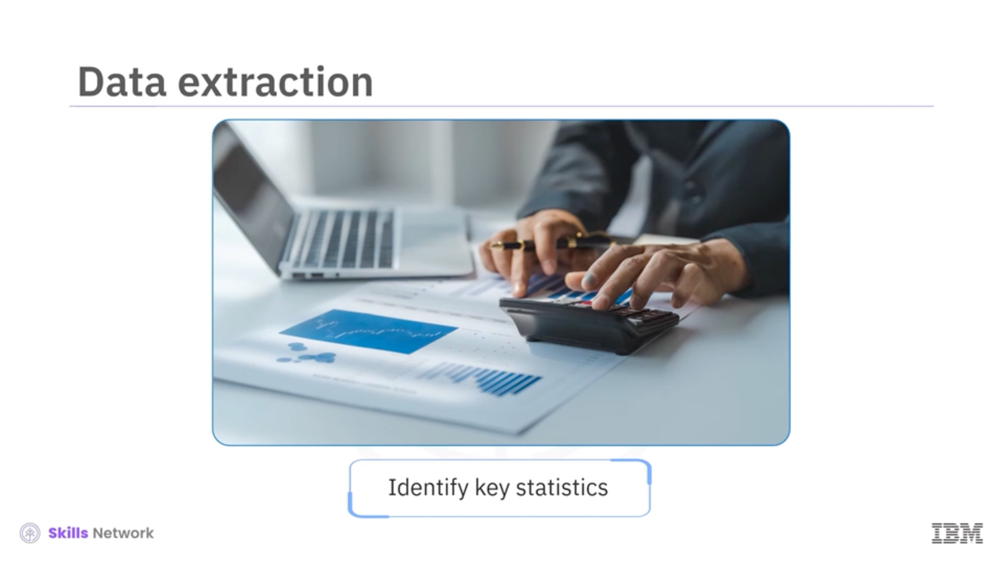
---

Los sistemas de preguntas y respuestas con LangChain pueden transformar la atención al cliente y los servicios basados 
en el conocimiento. 

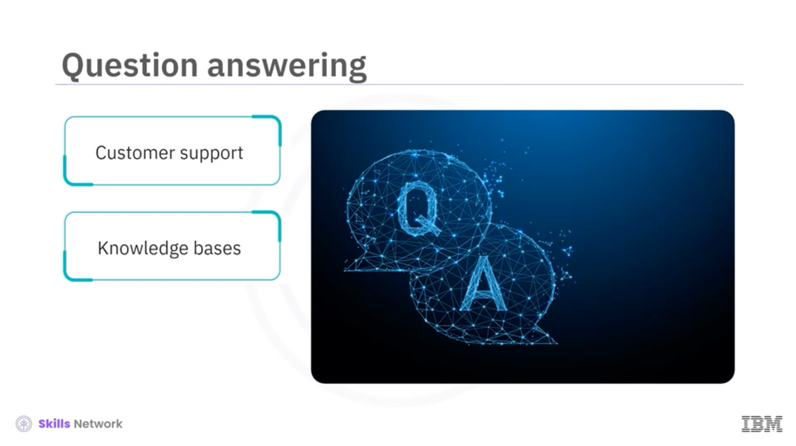

Estos sistemas pueden proporcionar respuestas contextualmente relevantes a una cadena de respuestas aclaratorias basadas 
en toda la conversación. 
---

LangChain puede ayudar en la generación de materiales escritos. El marco abre posibilidades para automatizar tareas 
rutinarias de escritura, como: 

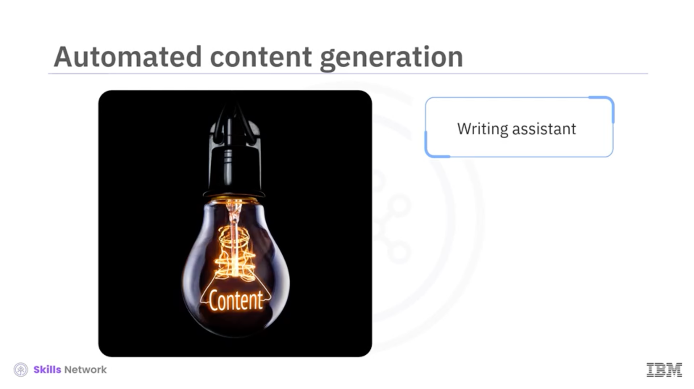

la redacción de correos electrónicos, la generación de lluvias de ideas o la documentación técnica. 

---

Aunque está diseñado principalmente para aplicaciones basadas en texto, LangChain puede trabajar con otros tipos de datos, 

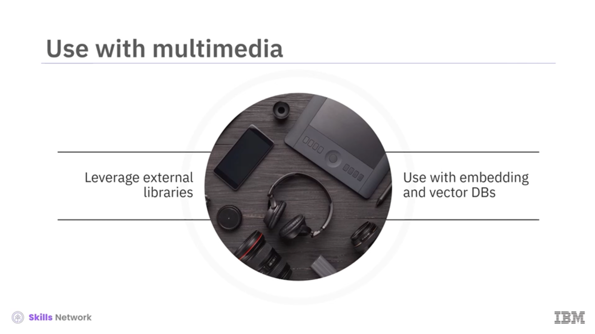

como imágenes, audio y vídeo, aprovechando bibliotecas y modelos externos como la conversión de voz a texto. 
Su integración con bases de datos vectoriales permite el uso de incrustaciones generadas a partir de estos tipos de datos 
para capturar el significado semántico y realizar búsquedas de similitud, lo que lo convierte en una herramienta valiosa 
para diversas tareas de IA. 

---

En este vídeo, aprendió que: 

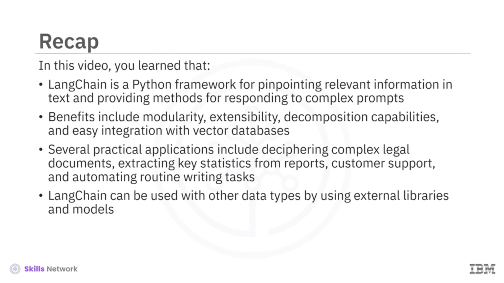

- LangChain es un marco de Python para identificar información y texto relevantes y proporcionar métodos para responder a preguntas complejas. 
- Las ventajas incluyen modularidad, extensibilidad, capacidades de descomposición y fácil integración con bases de datos vectoriales. 
- Entre sus aplicaciones prácticas se incluyen el descifrado de documentos legales complejos, la extracción de estadísticas clave de informes, la atención al cliente y la automatización de tareas rutinarias de escritura. 
- LangChain puede utilizarse con otros tipos de datos mediante bibliotecas y modelos externos.
