Bienvenido a los métodos avanzados de ingeniería de indicaciones. Después de ver este video, podrá aplicar métodos 
avanzados de ingeniería de prompts para mejorar el diseño de prompts. 

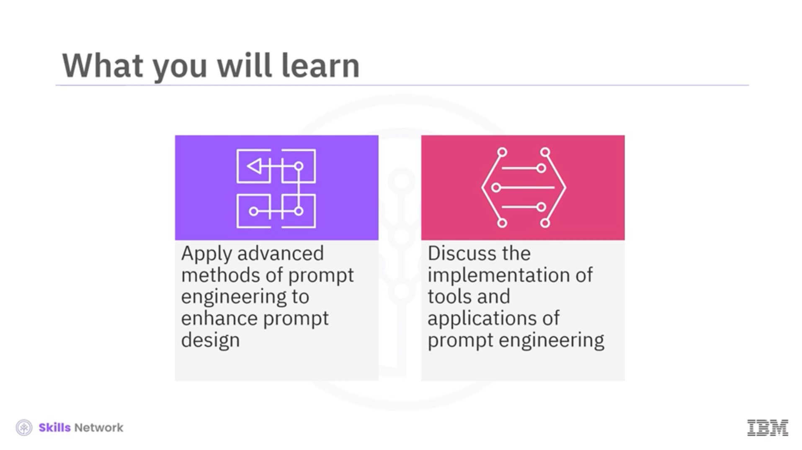

También podrá analizar la implementación efectiva de las herramientas y aplicaciones de la ingeniería de prompts en escenarios reales. 

---

En este ejemplo, aprenderá sobre un zero-shot prompt. Este tipo de prompt indica a un LLM que realice una tarea sin capacitación 
específica previa ni ejemplos. 

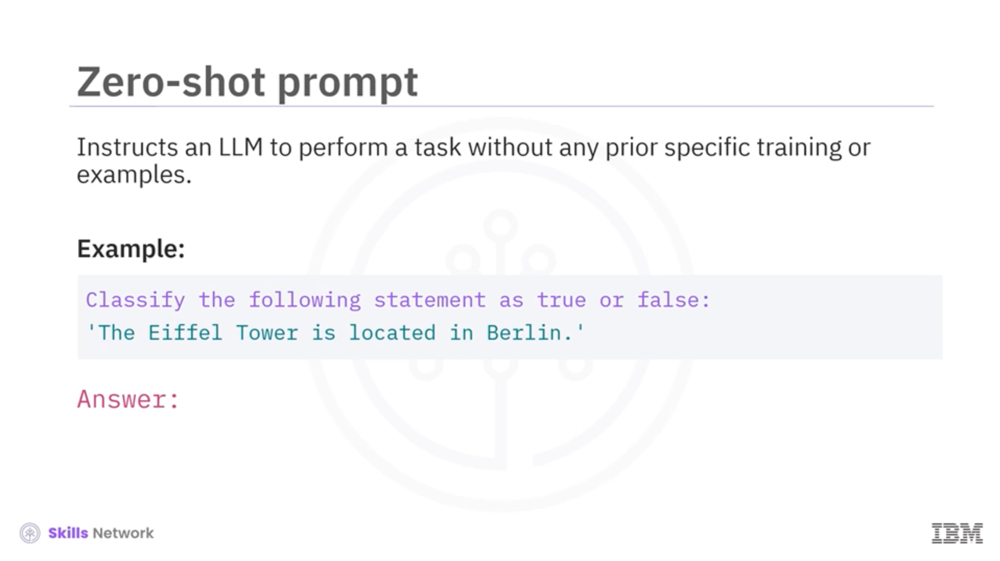

En este caso, se le pide al LLM que clasifique una afirmación como verdadera o falsa. La Torre Eiffel está ubicada en Berlín.
Luego, el modelo proporciona la respuesta. Esta tarea requiere que el LLM comprenda el contexto y la información sin ningún 
ajuste previo para la consulta específica. 
---
Un one-shot prompt le proporciona al LLM un solo ejemplo para ayudarle a realizar una tarea similar. Por ejemplo, 
"¿Cómo está el clima hoy?". El LLM muestra cómo traducir una oración del inglés al francés. 

Esto sirve como plantilla. Luego, se le da una nueva oración, "¿Dónde está el supermercado más cercano?", y se espera que 
la traduzca al francés utilizando el formato aprendido. La IA utiliza el ejemplo inicial para realizar correctamente la nueva 
traducción. 

---

Otro método es la few-shot prompting, donde la IA aprende de un pequeño conjunto de ejemplos antes de abordar una tarea similar. 

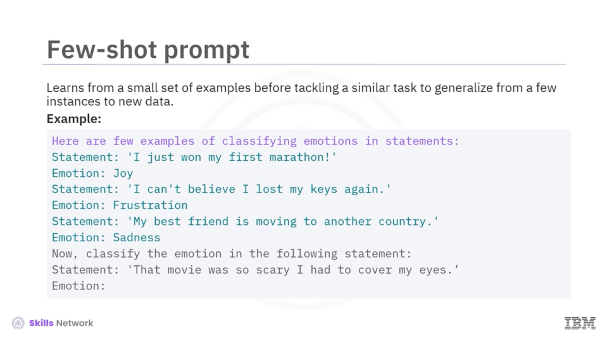

Esto ayuda a la IA a generalizar a partir de unas pocas instancias a nuevos datos. Por ejemplo, al LLM se le muestran tres 
afirmaciones, cada una etiquetada con una emoción. 

Estos ejemplos le enseñan al LLM a clasificar las emociones según el contexto. Luego, clasifica una nueva afirmación. 
"Esa película daba mucho miedo. Tuve que cubrirme los ojos". El LLM mostrará la emoción. 

---

La cadena de pensamiento o COT (chain-of-thought) prompting es una técnica utilizada para guiar al LLM a través de un 
razonamiento complejo paso a paso. 

Este método es muy eficaz para problemas que requieren múltiples pasos intermedios o un razonamiento que imita los procesos 
de pensamiento humano. 
---

El ejemplo muestra cómo se aplica la inducción CoT a un problema aritmético. La instrucción pide al modelo que considere 
el problema de una tienda que inicialmente tenía 22 manzanas, vendió 15 y luego recibió una nueva entrega de ocho manzanas. 

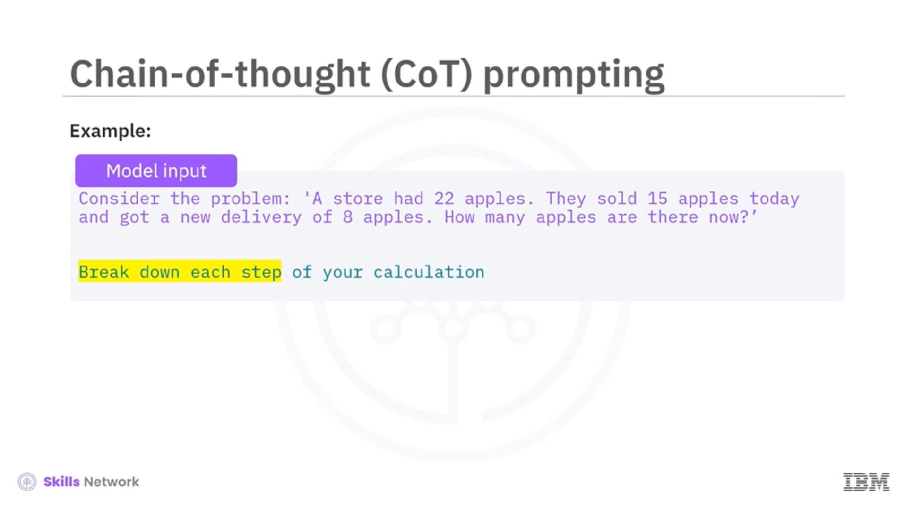

La tarea consiste en determinar cuántas manzanas hay ahora. 

---

Puede visualizar el resultado del modelo para la consulta de solicitud de CoT desglosando el cálculo en pasos secuenciales 
claros. 

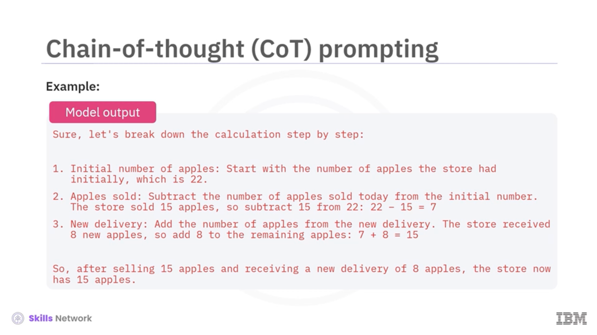

El modelo llega a la respuesta correcta y proporciona una explicación transparente. 

---

La Autoconsistencia (self-consistency) es una técnica para mejorar la fiabilidad y la precisión de los resultados. 

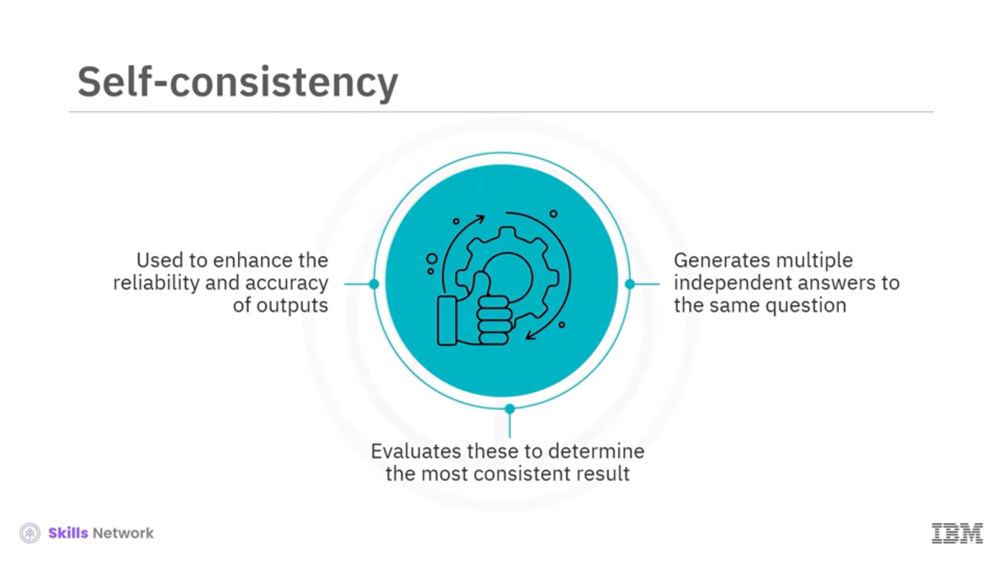

Implica generar múltiples respuestas independientes a la misma pregunta y evaluarlas para determinar el resultado más consistente. En este ejemplo, se presenta un problema que implica el cálculo de la edad. La consulta es: cuando tenía seis años, mi hermana tenía la mitad de mi edad. Ahora tengo 70. ¿Qué edad tiene mi hermana?
Se solicita al modelo que produzca tres cálculos y explicaciones independientes para garantizar la precisión. 

Puede visualizar los resultados del modelo con tres métodos de cálculo diferentes y determinar una respuesta consistente. 

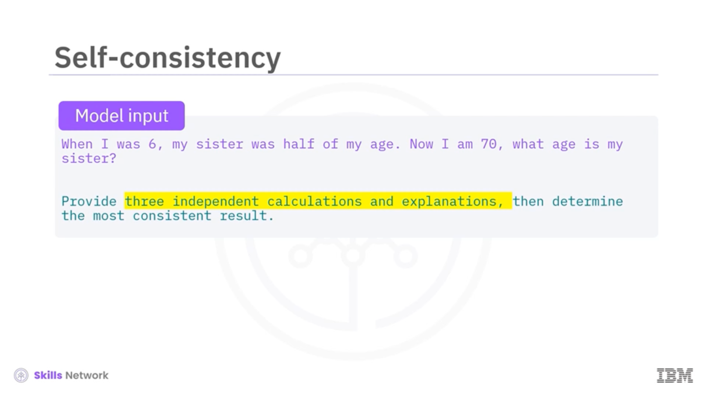

Este enfoque demuestra cómo la autoconsistencia puede verificar la fiabilidad de las respuestas de los LLM mediante la verificación 
cruzada de múltiples rutas hacia la misma respuesta. 
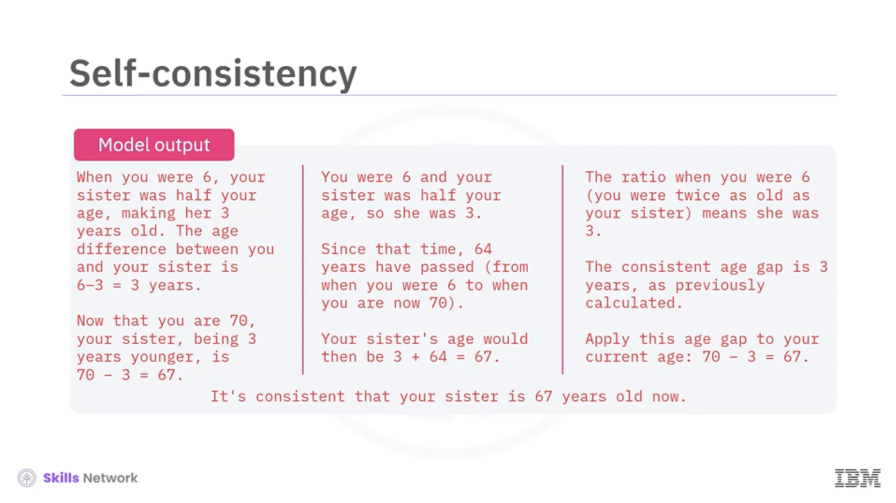
---

A continuación, exploremos las herramientas y aplicaciones utilizadas en prompt engineering. 
Ciertas herramientas, como Playground de OpenAI, LangChain, Model Hub de Hugging Face y AI Classroom de IBM, facilitan la 
interacción con los LLM. 

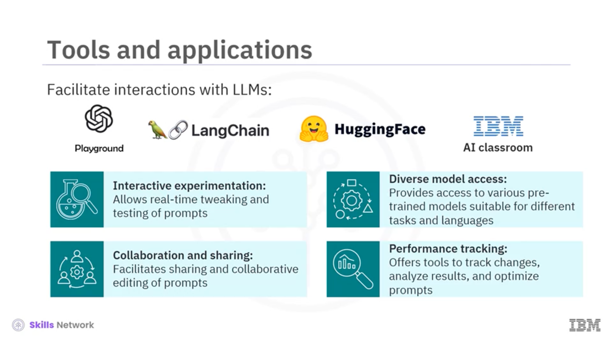

- Permiten desarrollar, experimentar, evaluar e implementar indicaciones. 
- Permiten ajustar y probar las indicaciones en tiempo real para ver resultados inmediatos.
- Además, brindan acceso a varios modelos preentrenados, adecuados para diferentes tareas e idiomas. 
- También facilitan el intercambio y la edición colaborativa de indicaciones entre equipos o comunidades. 
- Finalmente, ofrecen herramientas para realizar un seguimiento de los cambios, analizar resultados y optimizar las indicaciones 
según las métricas de rendimiento. 

---

Conozcamos más sobre LangChain, una herramienta para la ingeniería de indicaciones. 

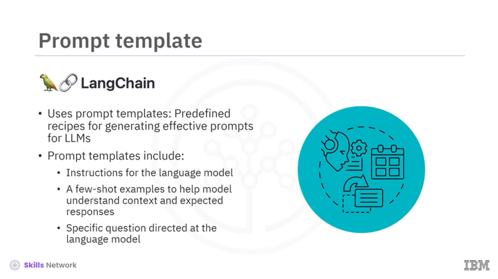

LangChain utiliza plantillas de prompts, recetas predefinidas para generar indicaciones efectivas para los LLM. 

Estas plantillas incluyen instrucciones para el modelo de lenguaje, algunos ejemplos para ayudar al modelo a comprender 
los contextos y las respuestas esperadas, y una pregunta específica dirigida al modelo de lenguaje. 
---

Aquí hay un fragmento de código para aplicar una plantilla de indicación de LangChain.

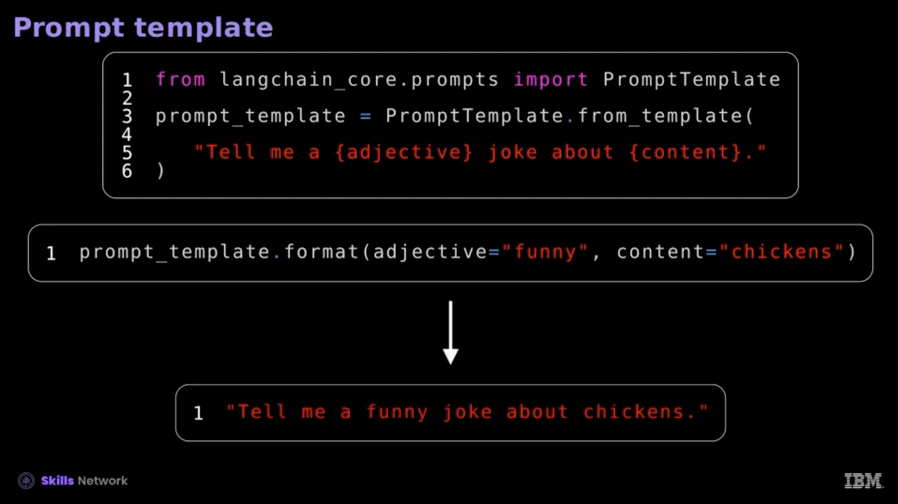

Primero, importe la plantilla de indicación desde las indicaciones principales de LangChain. Luego, define una plantilla 
de propuesta de chiste: "Cuéntame un chiste sobre". Esta plantilla tiene marcadores de posición para un adjetivo y el 
contenido. 

Para usar la plantilla, llama al formato de plantilla de propuesta con los valores específicos "gracioso" para el adjetivo 
y "pollos" para el contenido. Esto genera la propuesta: 
`"Cuéntame un chiste gracioso sobre pollos"`. 

Este enfoque simplifica la creación de propuestas, haciéndolas consistentes y adaptables a diferentes contextos. 
---
En las aplicaciones de propuestas, un agente es un concepto crucial.
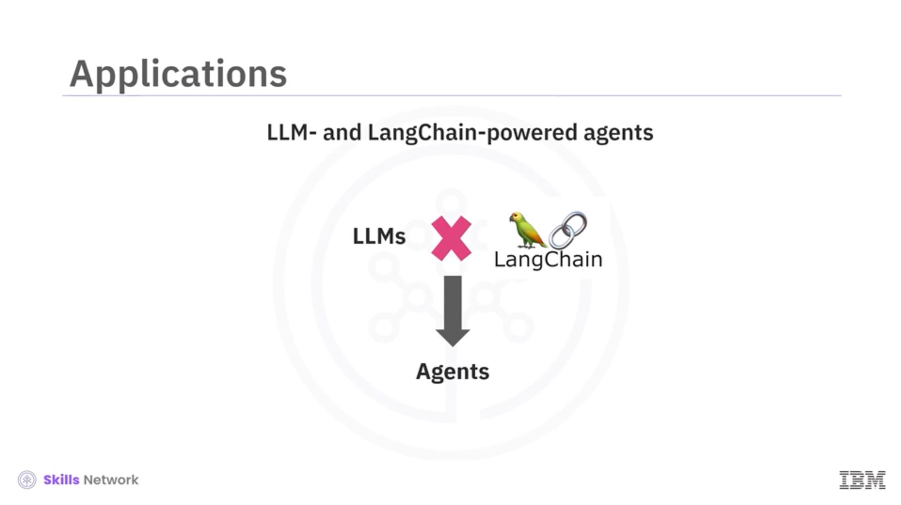

Impulsados por LLM y herramientas integradas como LangChain, los agentes realizan tareas complejas en diversos dominios 
utilizando diferentes propuestas. 
---

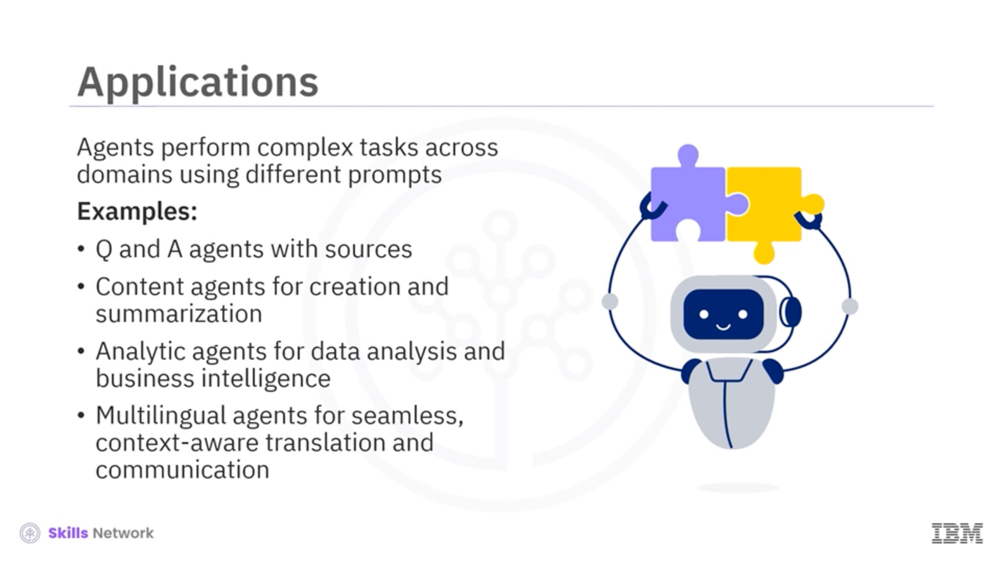

Las aplicaciones transformadoras incluyen agentes de preguntas y respuestas con fuentes, agentes de contenido para creación 
y resumen, y agentes analíticos para análisis de datos y negocios agentes multilingües para una traducción y comunicación 
fluidas y contextuales. 

---

Recapitulemos. En este video, aprendiste que
- los métodos avanzados para la ingeniería de indicaciones incluyen indicaciones 
de cero disparos, indicaciones de pocos disparos, indicaciones de cadena de pensamiento y autoconsistencia. 
- Las herramientas pueden facilitar las interacciones con los LLM. 
- LangChain utiliza plantillas de indicaciones para generar indicaciones efectivas. 
- En las aplicaciones de indicaciones, un agente puede realizar tareas complejas en diferentes dominios utilizando diferentes indicaciones.

